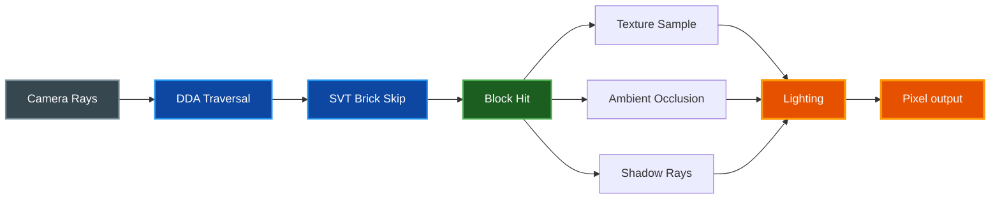

# Voxel World

[](LICENSE)

[](https://www.rust-lang.org)

A GPU-accelerated voxel sandbox using Vulkan compute shaders for real-time ray marching. A **creative mode** experience focused on building and exploration — no health, no death, just pure creativity. Features procedural terrain, day/night cycle, sub-voxel models, multiplayer, and an extensive creative toolkit.


## Quick Start

```bash
git clone https://github.com/paulrobello/voxel-world.git
cd voxel-world
make run
```

The Makefile handles macOS Vulkan environment variables automatically. First build compiles shaders (~1–3 min); subsequent builds are incremental.

### Quality Presets

```bash
make run-potato    # Minimum quality, maximum FPS
make run-low       # Basic lighting
make run-medium    # Balanced (default)
make run-high      # High quality
make run-ultra     # Maximum quality (GPU-intensive)
```

See [Quickstart Guide](docs/QUICKSTART.md) for a full walkthrough.

## Features

- **Vulkan Compute Shader Rendering** — Ray marching through voxel data entirely on GPU; no vertex/fragment pipeline
- **Sub-Voxel Model System** — Multi-resolution models (8³/16³/32³) for detailed blocks (torches, fences, doors, crystals)
- **Large Streaming World** — 512×512×512 resident window (16³ chunks of 32³ blocks), infinite X/Z via origin-shift streaming
- **Procedural Terrain** — 17 biome types driven by 5D climate noise (temperature, humidity, continentalness, erosion, weirdness)
- **Cave Systems** — 4 cave types: cheese, spaghetti, noodle, carved (~25% have surface entrances)
- **9 Tree Types** — Oak, birch, pine, willow, jungle, acacia, cactus, snow, mushroom
- **47 Block Types** — Stone, dirt, grass, glass, water, lava, crystal, and more
- **608 Painted Variants** — 19 textures × 32 tints for player-customized blocks
- **Water & Lava** — Cellular automata simulation with gravity, spread, and pressure
- **Falling Block Physics** — Sand and gravel fall; entire trees tumble when the trunk is broken
- **Ambient Occlusion** — Classic voxel AO with smooth corner darkening
- **Day/Night Cycle** — Dynamic sun position, sky colors, and lighting
- **Point Lights** — Torches, lava, glowstone, and crystals emit dynamic light with 10 animation modes
- **Animated Clouds & Stars** — Procedural clouds with wind drift, twinkling stars at night
- **Animated Water** — Flowing waves, caustics, and refraction effects
- **Translucent Glass** — See-through glass with frame borders and fresnel reflections; 32 tinted variants
- **Shadow Rays** — Directional sunlight shadows with distance-based LOD
- **Particle System** — Block break particles, water splashes, walking dust
- **Hot Reload Shaders** — Edit shaders while running, changes apply instantly
- **8 Debug Render Modes** — Normal, steps, depth, UV, coord, brick debug, shadow debug
- **Fly Mode** — Free flight for creative building
- **20+ Building Tools** — Cube, sphere, cylinder, torus, arch, bridge, helix, bezier, stairs, terrain brush, clone, and more
- **In-Game Model Editor** — Create custom sub-voxel models with 8 tools, mirror mode, undo/redo
- **Procedural Texture Generator** — Design custom block textures in-game with real-time pattern preview
- **In-Game Console** — Teleport, fill, sphere, locate biomes, and more
- **Minimap** — Bird's-eye view with rotation and configurable colors
- **Multiplayer** — Up to 4 players with encrypted UDP networking, full world sync

## Gallery

<table>
<tr>
<td width="50%">

**River through Forest**


</td>
<td width="50%">

**Desert at Sunset**


</td>
</tr>
<tr>
<td>

**Underground Caves**


</td>
<td>

**Settings & Block Palette**


</td>
</tr>
<tr>
<td>

**Model Editor**


</td>
<td>

**Texture Editor**


</td>
</tr>
<tr>
<td>

**Console Commands**


</td>
<td>

</td>
</tr>
</table>

## Block Types

| ID | Type | Break Time | Description |
|----|------|------------|-------------|
| 0 | Air | — | Empty space |
| 1 | Stone | 0.8s | Gray rocky surface |
| 2 | Dirt | 0.3s | Brown soil |
| 3 | Grass | 0.5s | Green grass top, dirt sides |
| 4 | Planks | 0.5s | Wooden floor planks |
| 5 | Leaves | 0.15s | Tree foliage (transparent) |
| 6 | Sand | 0.3s | Beach sand (falls) |
| 7 | Gravel | 0.3s | Small rocks (falls) |
| 8 | Water | — | Blue water (swimmable) |
| 9 | Glass | 0.5s | Transparent glass |
| 10 | Log | 0.5s | Tree bark with rings on top |
| 11 | Model | 0.15s | Sub-voxel model blocks |
| 12 | Brick | 0.8s | Red brick pattern |
| 13 | Snow | 0.3s | White snow cover |
| 14 | Cobblestone | 0.8s | Rough stone blocks |
| 15 | Iron | 1.2s | Metallic iron block |
| 16 | Bedrock | — | Indestructible foundation |
| 17 | TintedGlass | 0.5s | Colored glass (32 tints) |
| 18 | Painted | 0.5s | Textured block with tint |
| 19 | Lava | — | Glowing orange fluid |
| 20 | GlowStone | 0.5s | Bright warm light source |
| 21 | GlowMushroom | 0.15s | Soft cyan cave light |
| 22 | Crystal | 0.5s | Tinted crystal with light emission |
| 23–26 | Pine/Willow | 0.15–0.5s | Tree trunks and foliage |
| 27 | Ice | 0.5s | Slippery frozen water surface |
| 28–30 | Mud/Sandstone/Cactus | 0.15–0.8s | Desert and swamp terrain |
| 31–38 | Decorative | 0.3–1.0s | Decorative stone, concrete, deepslate, moss, clay, dripstone, calcite |
| 39–46 | Terrain | 0.15–0.8s | Terracotta, packed ice, podzol, mycelium, coarse/rooted dirt, birch |

## Installation

### From Source (Recommended)

```bash
git clone https://github.com/paulrobello/voxel-world.git
cd voxel-world

# Build and run (optimized)
make run

# Or use cargo directly
cargo run --release
```

Requires Rust 1.94.1+. Install from [rustup.rs](https://rustup.rs).

### Prerequisites

| Requirement | Notes |
|-------------|-------|
| **Rust 1.94.1+** | Install via [rustup](https://rustup.rs) |
| **Vulkan driver 1.2+** | GPU must support Vulkan compute shaders |
| **macOS** | `brew install molten-vk` |
| **Linux** | `sudo apt install libvulkan-dev mesa-vulkan-drivers` |
| **Windows** | Install the [Vulkan SDK](https://vulkan.lunarg.com/sdk/home) |

## Controls

### Movement & Interaction

| Key | Action |
|-----|--------|
| **Click** | Focus window (grab cursor) |
| **WASD** | Move |
| **Mouse** | Look around |
| **Space** | Jump / Fly up / Swim up / Climb up |
| **Shift** | Fly down / Swim down / Climb down |
| **Ctrl** | Toggle sprint (2× walk, 4× fly) |
| **F** | Toggle fly mode |
| **Left Click** (hold) | Break block |
| **Right Click** (hold) | Place block (line-locks after 2 blocks) |
| **Middle Click** | Pick block into hotbar slot |

### UI & Tools

| Key | Action |
|-----|--------|
| **1–9** | Select hotbar slot |
| **Scroll** | Cycle hotbar |
| **Esc** | Release cursor / Open settings panel |
| **B** | Toggle chunk boundaries |
| **M** | Toggle minimap |
| **J** | Toggle player torch light |
| **N** | Open model editor |
| **L** | Open template library |
| **/** | Open console |

### Default Hotbar

| Slot | Block |
|------|-------|
| 1 | Stone |
| 2 | Dirt |
| 3 | Grass |
| 4 | Sand |
| 5 | Log |
| 6 | Fence |
| 7 | Gate |
| 8 | Ladder |
| 9 | Torch |

## Architecture

Voxel World renders entirely through Vulkan compute shaders — there is no traditional vertex/fragment pipeline. All rendering is GPU ray marching through a 3D voxel texture.

```
src/
├── main.rs              # Vulkan setup, render loop, input handling
├── app/                 # Application loop: init, update, render, input, HUD
├── app_state/           # State containers: graphics, world sim, UI, multiplayer
├── chunk.rs             # Chunk storage (32³), BlockType enum, metadata channels
├── svt.rs               # Sparse Voxel Tree — 64-bit brick masks for ray skipping
├── world_streaming.rs   # Chunk streaming, GPU upload batching, origin shift
├── chunk_loader.rs      # Async chunk generation (rayon thread pool)
├── world/               # Multi-chunk management, queries, connections, lighting
├── world_gen/           # Biome system, climate noise, terrain, caves, rivers, trees
├── net/                 # Multiplayer: server, client, auth, LAN discovery, sync modules
├── sub_voxel/           # Model system: types, registry, GPU atlas, built-in generators
├── storage/             # Region files (.vxr), async I/O worker, model persistence
├── editor/              # In-game sub-voxel model editor (orbit camera, tools)
├── shape_tools/         # 20+ creative building tools (cube, sphere, arch, helix…)
├── ui/                  # egui panels for each tool and feature
├── console/             # In-game command line with per-command handlers
├── shaders/             # GLSL compute shaders (see below)
└── textures/            # Block textures and sprite generation

shaders/
├── traverse.comp        # Main ray marching shader
├── common.glsl          # Shared types, push constants, buffer layouts
├── models.glsl          # Sub-voxel model ray marching
├── lighting.glsl        # Point lights, shadows, AO
├── materials.glsl       # Texture atlas sampling, block type → atlas index
├── sky.glsl             # Sky gradient, sun, moon, stars, clouds
├── transparency.glsl    # Water and glass rendering
├── overlays.glsl        # Block break cracks, selection outlines, crosshair
├── accel.glsl           # SVT brick distance field, empty-chunk early-out
├── util.glsl            # Random, hash, noise utilities
├── generated_constants.glsl  # Auto-generated from Rust (build.rs — do not edit)
└── resample.comp        # Area-weighted image resampling
```

### Ray Marching Pipeline



Based on the Amanatides & Woo DDA algorithm. Key optimizations:

- **Empty chunk skip** — Rays skip entire 32³ air-only chunks (4.6× FPS improvement)
- **SVT-64 brick skip** — 64-bit brick masks with distance fields for empty-brick early-out
- **Per-ray dynamic step limit** — Optimal DDA steps calculated from ray direction
- **Distance-based LOD** — AO, shadows, and point lights fade with configurable thresholds
- **Per-chunk GPU uploads** — Only modified 32 KB chunks uploaded, not the full 32 MB world

See [Architecture](docs/ARCHITECTURE.md) for the full system design.

## Multiplayer

```bash
# Terminal 1: Start host
make run-host

# Terminal 2: Join as client
make run-client
```

The host runs an integrated `GameServer` and loopback `GameClient`. Remote clients connect over encrypted UDP (Netcode protocol). LAN discovery broadcasts on port 5001.

| Property | Values |
|----------|--------|
| Transport | UDP via renet + Netcode (encrypted) |
| Max players | 4 |
| Tick rate | 20 Hz |
| Channels | Player movement (unreliable), block updates, game state, chunk stream |
| Sync coverage | Blocks, chunks, players, water, lava, falling blocks, tree falls, day cycle, doors, pictures, custom textures |

See [CLI Reference](docs/CLI.md#multiplayer) for all multiplayer options.

## Platform Support

- **Windows** - Vulkan 1.2+
- **macOS** - MoltenVK (Vulkan on Metal)
- **Linux** - Vulkan 1.2+ (Mesa / NVIDIA)

## Technology

- **Rust** 1.94.1+ — Core implementation
- **Vulkan** — GPU compute shaders for ray marching (via ash)
- **egui** — Immediate mode GUI for settings, editors, and debug panels
- **renet** — UDP multiplayer networking with Netcode encryption
- **rayon** — Parallel chunk generation on background thread pool
- **bincode** — Efficient binary serialization for network and storage
- **lz4** — Chunk compression for network transfer
- **ash** — Vulkan API bindings
- **glam** — Mathematics library
- **egui-winit** — Window creation and input handling

## Development

### Build Commands

```bash
make build        # Release build
make run          # Build and run
make run-debug    # Debug build with RUST_BACKTRACE=1
make test         # Run tests
make fmt          # Format code
make lint         # Run clippy
make checkall     # Format + lint + test (required before committing)
```

### CLI Options

```bash
make run ARGS="--seed 42"                   # Custom terrain seed
make run ARGS="--fly-mode"                  # Start in fly mode
make run ARGS="--world-gen flat"            # Flat world
make run ARGS="--view-distance 8"           # Increase view distance
make run ARGS="--quality high"              # Quality preset
make run ARGS="--screenshot-delay 5"        # Screenshot after 5s
make run ARGS="--exit-delay 10"             # Exit after 10s
```

See [CLI Reference](docs/CLI.md) for the complete flag list.

### Benchmarking

```bash
make benchmark          # Flat terrain, 45s
make benchmark-hills    # Hilly terrain, 45s
make benchmark-spiral   # Spiral pattern, 90s
make benchmark-normal   # Normal terrain, 45s
```

Profile CSVs are written to `profiles/`. Compare runs with `make benchmark-compare ARGS="profiles/a.csv profiles/b.csv"`.

### Rust ↔ GLSL Constant Sync

`build.rs` auto-generates `shaders/generated_constants.glsl` from Rust source. `BLOCK_*`, `RENDER_MODE_*`, `ATLAS_TILE_COUNT`, `CHUNK_SIZE`, and `TINT_PALETTE` are defined in Rust and synced to GLSL on build — never edit the generated file manually.

## Documentation

### Getting Started
- [Quick Start Guide](docs/QUICKSTART.md) - Get running in under five minutes
- [CLI Reference](docs/CLI.md) - All command-line flags, env vars, Makefile targets

### Reference
- [Architecture](docs/ARCHITECTURE.md) - System design, module organization, data flow
- [Rendering](docs/RENDERING.md) - Ray marching pipeline, shader system
- [Physics](docs/PHYSICS.md) - Fluid simulation, falling blocks
- [Networking](docs/NETWORKING.md) - Multiplayer protocol and sync
- [World Editing](docs/WORLD_EDIT.md) - Building tools and commands
- [Model Editor](docs/MODEL_EDITOR.md) - Sub-voxel model editor tools and workflow
- [Texture Editor](docs/TEXTURE_EDITOR.md) - Procedural texture generator
- [CLI Reference](docs/CLI.md) - All command-line flags, env vars, Makefile targets

## Contributing

1. Fork the repository and create a feature branch
2. Run `make checkall` (format, lint, and test) before every commit
3. Keep commits atomic — one logical change per commit
4. Submit a pull request with a clear description

All contributions must pass:
- Formatting (`cargo fmt` or `make fmt`)
- Linting (`cargo clippy` or `make lint`)
- Tests (`cargo test` or `make test`)

## Resources

- [GitHub Repository](https://github.com/paulrobello/voxel-world)
- [Issue Tracker](https://github.com/paulrobello/voxel-world/issues)

## Performance Tips

For the best experience:
1. Run in release mode (`make run`)
2. Ensure GPU drivers are up to date
3. Start with `make run-medium`, increase quality gradually
4. Use `make run-potato` on integrated GPUs or older hardware
5. Reduce `--view-distance` if experiencing low FPS

## License

This project is licensed under the MIT License - see the [LICENSE](LICENSE) file for details.

## Author

Paul Robello - probello@gmail.com

## Acknowledgments

- Inspired by the voxel engines and ray marching techniques of the demoscene
- Built with the amazing Rust graphics ecosystem
- Thanks to the ash, egui, and renet communities

---

**Build, explore, and create in an infinite voxel world powered by GPU ray marching!**
