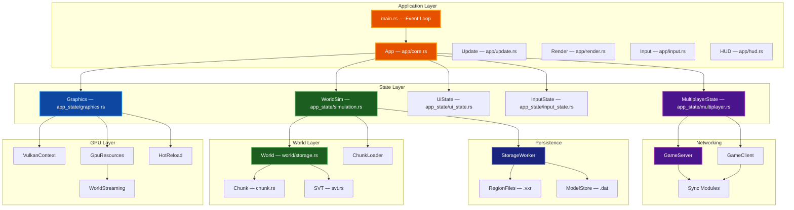
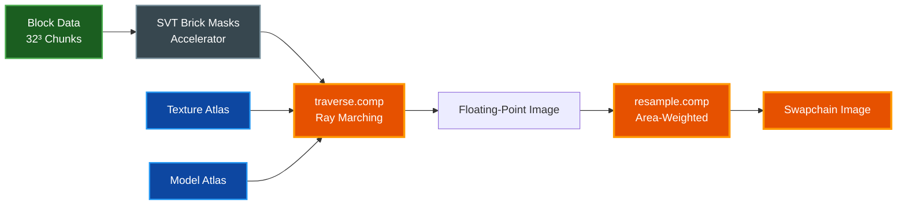
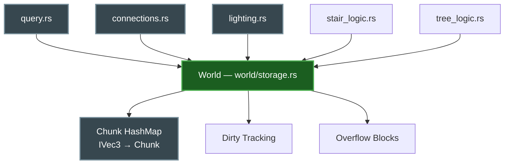
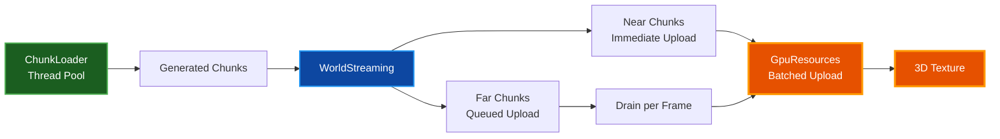
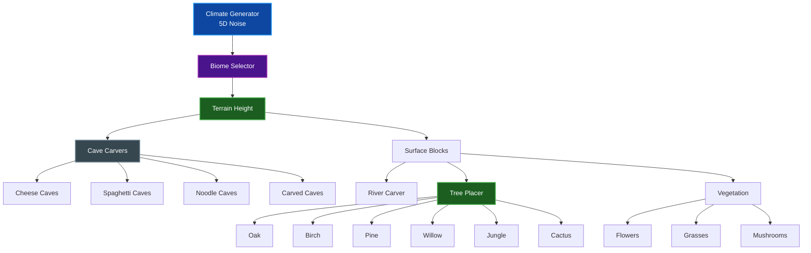
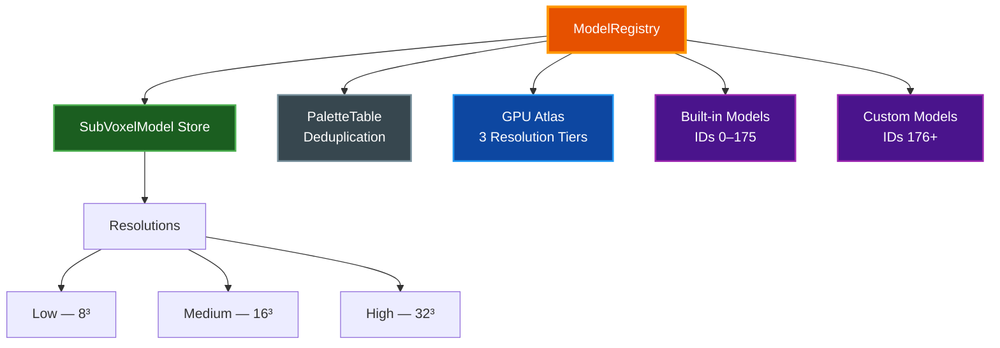
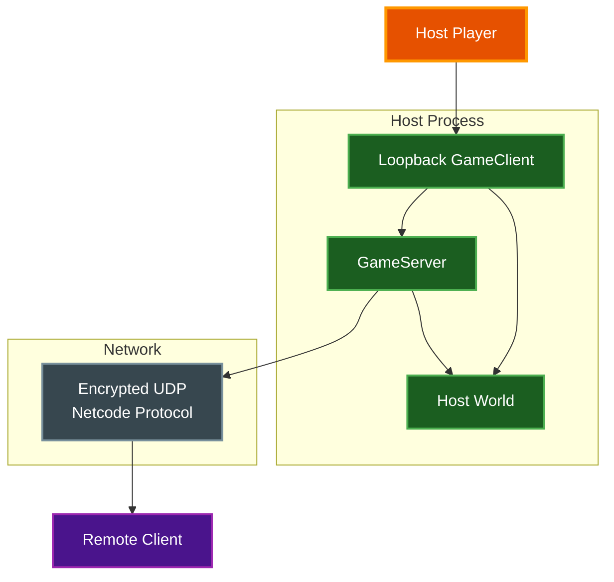
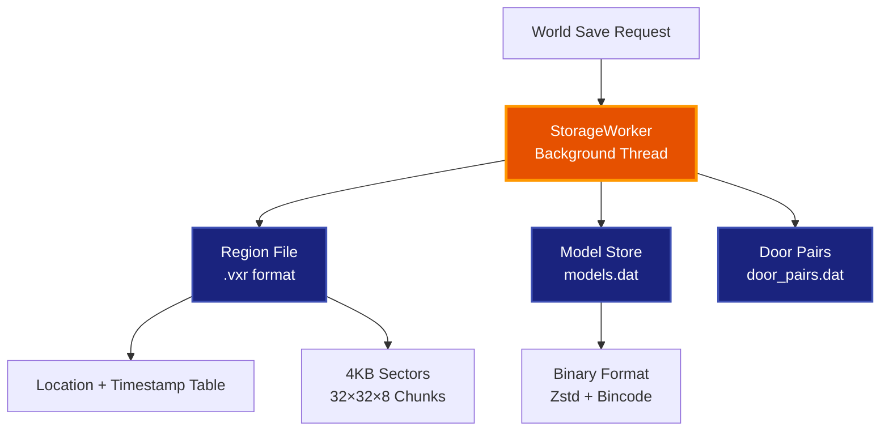

# Architecture

System design and module organization for the Voxel World engine — a GPU-accelerated voxel sandbox using Vulkan compute shaders for real-time ray marching.

## Table of Contents

- [Overview](#overview)
- [System Architecture](#system-architecture)
- [Rendering Pipeline](#rendering-pipeline)
- [World System](#world-system)
- [Chunk Streaming & GPU Upload](#chunk-streaming--gpu-upload)
- [World Generation](#world-generation)
- [Sub-Voxel Model System](#sub-voxel-model-system)
- [Multiplayer Networking](#multiplayer-networking)
- [Storage & Persistence](#storage--persistence)
- [Player & Physics](#player--physics)
- [Editor System](#editor-system)
- [Shape Tools & Creative Toolkit](#shape-tools--creative-toolkit)
- [Console & Commands](#console--commands)
- [Shader Reference](#shader-reference)
- [Build System](#build-system)
- [Coordinate Systems](#coordinate-systems)
- [Related Documentation](#related-documentation)

## Overview

**Purpose:** Voxel World renders a 512x512x512-block resident window via GPU ray marching, streaming chunks infinitely along X/Z through origin-shift operations. The engine is written in Rust (edition 2024) with all rendering handled by Vulkan compute shaders — there is no traditional vertex/fragment pipeline.

**Key design goals:**

- Zero mesh generation — blocks are ray-marched directly from a 3D texture
- Per-chunk dirty tracking — only modified chunks are re-uploaded to the GPU (~32 KB vs 32 MB full-world upload)
- Async chunk generation on a thread pool with epoch-based cancellation on origin shifts
- Multiplayer via encrypted UDP with per-subsystem sync modules

**Tech stack:** Rust, Vulkan (vulkano), GLSL compute shaders, egui, renet networking, rayon parallelism

## System Architecture

### Game Loop

The game loop in `app/update.rs` runs each frame in this order:

1. **Process network events** — receive and dispatch multiplayer messages
2. **Handle input** — keyboard/mouse → tool activation → block changes
3. **Update simulation** — water, lava, falling blocks, particles, block update queue
4. **Stream chunks** — `world_streaming.rs` manages the resident window and GPU uploads
5. **Render** — `app/render.rs` builds push constants, dispatches `traverse.comp`, resamples, presents

### Module Layout

| Module | Files | Purpose |
|--------|-------|---------|
| `app/` | 12 impl files | Central `App` struct split by responsibility: init, render, update, input, event handling, HUD, minimap, network sync |
| `app_state/` | 9 files | State containers: `Graphics`, `WorldSim`, `UiState`, `InputState`, `MultiplayerState`, profiling |
| `world/` | 8 files | Multi-chunk management: storage, queries, connections, lighting, stair/tree logic, tests |
| `world_gen/` | ~15 files | Biome system, climate noise, terrain height, caves, rivers, trees, vegetation |
| `net/` | ~21 files | Multiplayer: server, client, authentication, LAN discovery, per-subsystem sync modules |
| `sub_voxel/` | 12 files | Model system: types, model data, registry, built-in generators |
| `storage/` | 7 files | Persistence: region files, async worker, model store, metadata |
| `editor/` | 3 files | In-game sub-voxel model editor with orbit camera and tools |
| `shape_tools/` | 20+ files | Creative building tools: cube, sphere, arch, helix, bezier, clone, terrain brush |
| `ui/` | 30+ files | egui panels for each tool and feature |
| `console/` | 15+ files | In-game command-line with individual command handlers |
| `shaders/` | 12 GLSL files | Compute shader pipeline (see Shader Reference below) |

## Rendering Pipeline

The engine uses Vulkan **compute shaders** exclusively — there is no vertex/fragment pipeline. All rendering is ray marching through a 3D voxel texture.

**How it works:**

1. `traverse.comp` ray-marches from the camera through the 3D block volume (512x512x512 on high settings)
2. The Sparse Voxel Tree (SVT) in `accel.glsl` skips empty bricks using 64-bit brick masks, avoiding wasted work on empty space
3. Sub-voxel models are rendered inline via `models.glsl` — the shader performs a secondary DDA traversal within the model volume
4. Output is a floating-point image at render resolution (configurable via `--quality`)
5. `resample.comp` downsamples to the window swapchain size using area-weighted filtering

**Push constants** carry per-frame data: camera position/direction, time of day, render mode, origin offset, player torch state. See `build_push_constants()` in `app/render.rs`.

**Hot reload:** `hot_reload.rs` watches shader files via `notify`, recompiles on change with a custom `#include` preprocessor that detects diamond includes.

## World System

### Chunk Storage

Each chunk is 32³ blocks stored as a flat byte array. Block types are defined in `BlockType` enum (`chunk.rs`) with 47 variants. Three metadata channels extend each block:

| Channel | Blocks | Data |
|---------|--------|------|
| **Model** | Fences, doors, torches, etc. | Model ID + rotation |
| **Tinted** | Tinted glass, crystals | Tint index (0–31) into `TINT_PALETTE` |
| **Painted** | Player-customized blocks | Texture index (0–18) × tint index (0–31) |

The `Chunk::mutation_epoch` counter increments on every block change, used for:
- Chunk streaming dedup (skip re-sending unchanged chunks to clients)
- GPU dirty tracking (only re-upload modified chunks)
- LZ4 compression cache invalidation

### Sparse Voxel Tree

`ChunkSVT` (`svt.rs`) builds a 64-bit brick mask per chunk (8³ bricks of 4³ voxels each). The shader queries `isChunkEmpty()` to short-circuit on empty chunks before reading brick data. On origin shift, the metadata reset only uploads the tiny `chunk_bits` buffer — larger `brick_masks` and `brick_distances` buffers stay stale for empty slots since the shader never reads them.

### World Module

The `World` struct holds a `HashMap<IVec3, Chunk>` with dirty-set tracking. Helper modules handle connectivity logic (fences, panes, stairs), light propagation, and tree structure detection.

## Chunk Streaming & GPU Upload

Performance-critical pipeline — the origin-shift hot path runs through these modules:

**ChunkLoader** (`chunk_loader.rs`) runs a rayon thread pool for background chunk generation. Epoch-bumping cancels in-flight work on origin shifts.

**WorldStreaming** (`world_streaming.rs`) owns the `MetadataState` (CPU-side SVT / brick-mask buffers). On origin shift:
1. Async texture clear
2. Partition chunks into near (immediate bulk upload) and far (queued in `reupload_queue`)
3. Drain the queue across subsequent frames via `upload_world_to_gpu()`

**GpuResources** (`gpu_resources.rs`) handles the actual GPU upload:
- `upload_chunks_batched()` packs chunks into staging buffers with merged `BufferImageCopy` regions
- Zero-slice skip avoids memcpy for all-zero metadata channels when the destination is known-zero
- Z-adjacent chunks at the same (y, x) merge into single multi-depth regions
- Thread-local `STAGING_POOL` + `TRANSFER_RING` reuse HOST-visible buffers across uploads

## World Generation

The generation pipeline uses 5D climate noise (temperature, humidity, continentalness, erosion, weirdness) to select from 17 biome types. Terrain height varies by biome (flat plains, rolling hills, mountains up to 90 blocks). Four cave carver types create underground networks. Trees and vegetation are placed post-surface based on biome suitability.

## Sub-Voxel Model System

Models provide detail finer than a single block — torches, fences, doors, crystals, flowers, etc.

**Model structure:** N³ byte array of palette indices (0=air), 32-color RGBA palette, per-slot emission intensity, 64-bit collision mask (4x4x4 coarse grid), light animation mode.

**Built-in categories:**

| Category | Model IDs | Description |
|----------|-----------|-------------|
| Basic | 1–3 | Torch, slabs |
| Fences | 4–19 | 16 connection variants |
| Gates | 20–27 | Open/closed states |
| Stairs | 28–38 | Straight, corners, floor/ceiling |
| Doors/Windows | 39–98 | Hinge variants, panels, glass, trapdoors |
| Crystal | 99 | Tinted by block metadata |
| Vegetation | 100–118 | Grass, flowers, lily pad, mushrooms, moss |
| Glass panes | 119–150 | 16 horizontal + 16 vertical connection variants |

**GPU upload:** `ModelRegistry` tracks `dirty_model_ids`, `dirty_palette_ids`, and `tier_dirty` flags. `gpu_resources::upload_model_registry_incremental()` only repacks the affected atlas regions.

## Multiplayer Networking

Transport is UDP via `renet` + `renet_netcode` with per-session authentication. The host runs both a `GameServer` and a loopback `GameClient`.

### Channel Architecture

| Channel | Reliability | Frequency | Data |
|---------|-------------|-----------|------|
| `PlayerMovement` | Unreliable | ~20 Hz | Position, velocity, rotation |
| `BlockUpdates` | Reliable unordered | On change | Block place/break, bulk ops |
| `GameState` | Reliable ordered | On event | Join/leave, chat, time sync |
| `ChunkStream` | Reliable unordered | On demand | Compressed chunk data (LZ4) |

### Sync Modules

Each multiplayer subsystem has a dedicated sync module in `net/`:

| Module | Syncs |
|--------|-------|
| `block_sync.rs` | Block changes with area-of-interest filtering |
| `chunk_sync.rs` | Priority-based chunk streaming with cancellation |
| `player_sync.rs` | Client prediction + server reconciliation |
| `fluid_sync.rs` | Water/lava cell compression |
| `falling_block_sync.rs` | Falling block spawn/land events |
| `tree_fall_sync.rs` | Tree fall physics replication |
| `day_cycle_sync.rs` | Time-of-day synchronization |
| `extended_gameplay_sync.rs` | Door toggles, picture frames |
| `picture_store.rs` | Picture upload/download/management |
| `texture_slots.rs` | Custom texture pool (32 slots) |

### Key Patterns

- **Originator exclusion:** `broadcast_encoded_except()` sends to all clients except the originating one, preventing action echo
- **Epoch-aware dedup:** `recently_sent_chunks` tracks `(sent_time, mutation_epoch)` per client per chunk position — skips re-sending unchanged chunks
- **Host loopback detection:** Anti-cheat validation is bypassed for the host's own client (allows spawn-teleport, fly-mode without false positives)
- **Authentication:** Secure mode with per-session random 32-byte key; host loopback receives the key directly via `GameClient::with_key()`

## Storage & Persistence

**Region files** use a Minecraft-inspired `.vxr` format: 32×32 horizontal × 8 vertical chunks per file, 4 KB sectors with location/timestamp header tables.

**StorageWorker** runs on a dedicated thread communicating via `crossbeam-channel` with `Load`/`Save`/`Shutdown` commands. Region files are lazily opened.

**Chunk serialization:** `SerializedChunk` stores blocks, model metadata, tint data, paint data, and frame data. Compressed with Zstd level 3, serialized via bincode.

**Model persistence:** `WorldModelStore` saves all custom models to `models.dat`, `DoorPairStore` saves door pairings to `door_pairs.dat`.

## Player & Physics

| System | File | Description |
|--------|------|-------------|
| Player | `player.rs` | First-person controller with AABB collision, gravity, fly mode, swimming |
| Camera | `camera.rs` | View matrix with head bob animation |
| Raycast | `raycast.rs` | DDA raycast for block targeting |
| Water | `water.rs` | Cellular automata: gravity → horizontal spread → pressure rise |
| Lava | `lava.rs` | Slower cellular automata with glow and light emission |
| Falling blocks | `falling_block.rs` | Sand/gravel physics with natural stacking |
| Block updates | `block_update.rs` | Frame-distributed priority queue: gravity, tree fall, water spread |
| Particles | `particles.rs` | GPU-buffered particle system (block break, water splash, walking dust) |

Physics updates are spread across frames via `BlockUpdateQueue` with configurable budget (16–128 updates/frame). The priority queue processes nearby blocks first.

## Editor System

The in-game editor (`editor/`, activated with N key) provides a full sub-voxel model creation environment:

- **Orbit camera** replaces player movement when editing
- **8 tools:** Pencil, Eraser, Eyedropper, Fill (flood fill), Cube, Sphere, ColorChange, PaintBucket
- **Mirror mode** on X/Y/Z axes (up to 8-way symmetry)
- **Resolution switching** between 8³/16³/32³ with voxel preservation
- **Undo/redo** with dual-stack (100 states max)
- **DDA ray-voxel intersection** for precise hover detection
- **Door pair creation** linking 4 custom models as functional doors

## Shape Tools & Creative Toolkit

20+ building tools in `shape_tools/` with matching UI panels in `ui/`:

| Category | Tools |
|----------|-------|
| **Primitives** | Cube, Sphere, Cylinder, Torus, Cone |
| **Structures** | Wall, Floor, Stairs, Arch, Bridge, Helix |
| **Curves** | Bezier, Circle, Polygon |
| **Modifiers** | Hollow, Mirror, Replace, Pattern, Clone |
| **Terrain** | Terrain Brush (sculpt/flatten/smooth), Scatter |

All tools follow a consistent pattern: state struct in `shape_tools/`, egui panel in `ui/`, block placement via `block_interaction/`.

## Console & Commands

The in-game console (`/` key) provides command-line access with handlers in `console/commands/`:

| Command | Description |
|---------|-------------|
| `tp` | Teleport to coordinates |
| `boxme` | Create a box around the player |
| `sphere` | Create a sphere at position |
| `fill` | Fill a region with blocks |
| `floodfill` | Flood fill from position |
| `measure` | Measure distance between points |
| `positions` | Show coordinate bookmarks |
| `select` | Selection operations |
| `stencil` | Stencil operations |
| `template` | Template operations |
| `texture` | Texture management |
| `picture` | Picture frame management |
| `copy` | Copy selection to template |
| `locate` / `locate_async` | Find nearest biome or structure |

## Shader Reference

All rendering happens in GLSL compute shaders. There is no vertex/fragment pipeline.

| Shader | Purpose |
|--------|---------|
| `traverse.comp` | Main ray marching: DDA traversal, SVT brick skipping, texture sampling, AO, shadows, point lights |
| `resample.comp` | Area-weighted downsample from render resolution to window swapchain |
| `common.glsl` | Shared types: Uniforms, `ModelProperties`, `ChunkMetadata`, per-chunk flags |
| `accel.glsl` | SVT brick distance field, empty-chunk early-out |
| `models.glsl` | Sub-voxel model rendering: atlas lookup, palette sampling, collision mask |
| `materials.glsl` | Texture atlas sampling, painted block blending, custom textures, `blockTypeToAtlasIndex()` |
| `lighting.glsl` | Ambient occlusion, directional shadows (2-pass DDA), point light shadows |
| `sky.glsl` | Day/night sky gradient, sun/moon, cloud rendering |
| `overlays.glsl` | Debug overlays: chunk boundaries, block highlight, crosshair, break progress |
| `transparency.glsl` | Glass/water transparency, refraction approximation |
| `util.glsl` | Random, hash, noise utility functions |
| `generated_constants.glsl` | Auto-generated by `build.rs` from Rust enums/constants |

**Include chain:** `traverse.comp` → `common.glsl` → `accel.glsl`, `util.glsl`, `sky.glsl`, `models.glsl`, `lighting.glsl`, `materials.glsl`, `overlays.glsl`, `transparency.glsl`

> **Note:** `generated_constants.glsl` is auto-generated by `build.rs` — never edit it manually. Edit the Rust source (`chunk.rs`, `constants.rs`, `render_mode.rs`, `svt.rs`) and the GLSL constants update on next build.

## Build System

**`build.rs`** parses Rust source files and generates `shaders/generated_constants.glsl`:
- `BlockType` variants → `BLOCK_*` defines
- `RenderMode` variants → `RENDER_MODE_*` defines
- Constants: `CHUNK_SIZE`, `BRICK_SIZE`, `ATLAS_TILE_COUNT`, `WORLD_CHUNKS_Y`, `LOADED_CHUNKS_X/Z`
- `TINT_PALETTE` → `const vec3 TINT_PALETTE[32]`

The script only writes when content changes to avoid spurious recompiles.

**`Makefile`** provides standard targets: `build`, `run`, `test`, `fmt`, `lint`, `checkall`, plus quality presets, multiplayer commands, benchmarking suite, and profiling workflows.

## Coordinate Systems

| System | Range | Description |
|--------|-------|-------------|
| **World coordinates** | `i32` | Global block positions |
| **Chunk coordinates** | `i32` | Chunk grid positions (each chunk = 32³ blocks) |
| **Local coordinates** | 0–31 | Position within a chunk |
| **Texture coordinates** | 0–511 | Block offset in the resident 512³ window |
| **Sub-voxel** | 0–7 / 0–15 / 0–31 | Voxels within a model (8³/16³/32³ resolution) |

**Helpers:** `World::world_to_chunk()`, `World::world_to_local()`, `world_streaming::world_pos_to_chunk_index()`

## Related Documentation

- [Documentation Style Guide](DOCUMENTATION_STYLE_GUIDE.md) — Standards for all project documentation
- [CLAUDE.md](../CLAUDE.md) — AI assistant instructions, build commands, and development workflow
- [README.md](../README.md) — Project overview, features, controls, and getting started guide
