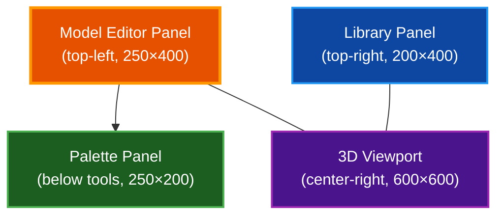

# Model Editor

In-game sub-voxel model editor for creating and placing custom 3D voxel models (press **N** to open). Supports three resolutions, nine tools, ten animated light modes, and a persistent model library.

## Table of Contents

- [Overview](#overview)
- [Opening and Closing](#opening-and-closing)
- [Editor Layout](#editor-layout)
- [Tools](#tools)
- [Palette](#palette)
- [Mirror Mode](#mirror-mode)
- [Resolution](#resolution)
- [Model Properties](#model-properties)
- [Light Modes](#light-modes)
- [Undo and Redo](#undo-and-redo)
- [Library](#library)
- [Door Pairs](#door-pairs)
- [Placing Models in the World](#placing-models-in-the-world)
- [File Format](#file-format)
- [Keyboard Shortcuts](#keyboard-shortcuts)
- [Troubleshooting](#troubleshooting)
- [Related Documentation](#related-documentation)

## Overview

The Model Editor lets you design sub-voxel models — 3D objects built from tiny cubes inside a single block space. Models use a 32-color palette and support per-color emission, animated light sources, and three detail levels (8³, 16³, 32³ voxels).

Custom models are saved to a persistent library (`user_models/*.vxm`) and registered in the world's model registry alongside the 176 built-in models. Each world also persists its active models in `models.dat`.

**Key capabilities:**

- Nine editing tools (pencil, eraser, flood fill, cube, sphere, bridge, and more)
- Three-axis mirror mode for symmetric designs (up to 8× replication)
- Full undo/redo history (100 levels)
- Software-rasterized 3D viewport with orbit camera
- Per-palette-slot emission and ten animated light modes
- Custom door pairs from any four saved models

## Opening and Closing

### Opening

Press **N** at any time during gameplay. The editor opens as an overlay and releases the mouse cursor for UI interaction.

The editor remembers the block you were looking at before opening — this becomes the placement target when you use **Place in World**.

### Closing

- Press **N** again to toggle closed
- Press **Escape** to close directly

If the game cursor was grabbed (first-person mode) before opening, it is re-grabbed on close.

## Editor Layout

The editor displays four overlapping egui windows:

| Window | Position | Contents |
|--------|----------|----------|
| **Model Editor** | Top-left | Tool buttons, mirror toggles, properties, save/load controls |
| **Palette** | Below Model Editor | 4×8 color grid, RGBA sliders, emission toggle |
| **Library** | Top-right | Saved model list, load/delete buttons, door pair creator |
| **3D Viewport** | Center-right | Interactive isometric preview with orbit camera |

## Tools

Select tools from the Model Editor panel buttons. Each tool has distinct click behavior in the 3D viewport.

### Tool Reference

| Tool | Left Click | Right Click | Description |
|------|-----------|-------------|-------------|
| **Pencil** | Place voxel | Erase voxel | Place single voxels adjacent to existing surfaces or on the floor |
| **Eraser** | Erase voxel | Erase voxel | Remove voxels (respects mirror mode) |
| **Eyedropper** | Pick color | Erase voxel | Sample a color from an existing voxel, then auto-switch to Pencil |
| **Cube** | Place cube | Erase voxel | Place a filled cube shape centered at the click point |
| **Sphere** | Place sphere | Erase voxel | Place a filled sphere shape centered at the click point |
| **Paint Bucket** | Flood fill | Erase voxel | Fill all connected voxels of the same color (6-way BFS) |
| **Bridge** | Set start / draw line | Cancel bridge | First click sets a start point; second click draws a 3D Bresenham line between them |
| **Color Change** | Recolor voxel | Erase voxel | Change an existing voxel's color without affecting neighbors |
| **Fill** | *(unused)* | *(unused)* | Legacy tool; use Paint Bucket instead |

### Shape Size

The **Cube** and **Sphere** tools use a size slider (1 to model resolution). The shape is centered on the clicked voxel.

### Mouse Buttons in Viewport

| Button | Action |
|--------|--------|
| Left click | Primary tool action |
| Right click | Always erases (or cancels bridge) |
| Middle click | Always picks color (eyedropper) |
| Secondary drag | Orbit camera rotation |
| Scroll wheel | Zoom in/out |

## Palette

Each model has a 32-color palette. Palette slot 0 is always transparent (air).

### Default Palette

| Slots | Colors |
|-------|--------|
| 0 | Air (transparent) |
| 1 | Light gray, Wood brown, Red, Green, Blue |
| 6 | Yellow, Orange, Purple, Cyan |
| 10 | Pink, White, Dark gray, Black |
| 14 | Glass-like (semi-transparent), Warm light |
| 16–31 | Empty (available for custom colors) |

### Editing Colors

- **Left-click** a swatch to select it as the active color
- **Right-click** a swatch to open a color picker
- Use the RGBA sliders below the grid for fine adjustment

### Emission

Each palette slot can have an emission intensity (0.0–1.0). Emissive colors glow in the rendered world. Toggle the emission checkbox and adjust the slider per slot.

## Mirror Mode

Mirror mode replicates edits symmetrically across one, two, or three axes simultaneously.

### Axis Controls

Toggle **X**, **Y**, or **Z** buttons in the Model Editor panel:

| Active Axes | Replication | Display |
|-------------|-------------|---------|
| 1 axis | 2× | "(2x)" |
| 2 axes | 4× | "(4x)" |
| 3 axes | 8× | "(8x)" |

### Visual Indicators

Colored wireframe planes appear in the 3D viewport at each axis midpoint:

| Axis | Plane Color |
|------|-------------|
| X | Red |
| Y | Green |
| Z | Blue |

### Behavior

- Works with Pencil, Eraser, Cube, Sphere, and Paint Bucket tools
- Color Change and Eyedropper do **not** mirror
- All mirrored positions are recorded as a single undo operation

## Resolution

Models support three detail levels:

| Resolution | Dimensions | Voxel Count | Orbit Distance |
|------------|------------|-------------|----------------|
| **Low** | 8³ | 512 | 25 |
| **Medium** | 16³ | 4,096 | 40 |
| **High** | 32³ | 32,768 | 70 |

### Changing Resolution

Change resolution via the combo box in the Properties section. A confirmation dialog explains the conversion:

- **Upscaling** (e.g., 8 → 16): Each voxel subdivides into a 2×2×2 cube
- **Downscaling** (e.g., 32 → 16): Nearest-neighbor sampling from region centers (may lose detail)

Changing resolution clears undo history and adjusts the camera orbit distance.

### New Model

Click **New** to create a fresh model. A dialog offers radio buttons for 8, 16, or 32 resolution. This replaces the current scratch pad and clears undo history.

## Model Properties

The **Properties** collapsible section in the Model Editor panel contains:

| Property | Type | Description |
|----------|------|-------------|
| **Resolution** | Combo | 8 / 16 / 32 — changes model detail level |
| **Rotatable** | Checkbox | Whether the model can be rotated when placed in the world |
| **Requires Ground** | Checkbox | Model must be placed on a solid surface |
| **No Collision** | Checkbox | Players and entities pass through the model |
| **Emission** | Toggle + Color | Per-model global emission (separate from per-palette-slot emission) |
| **Light Source** | Toggle | Enables animated light emission from this model |

## Light Modes

When **Light Source** is enabled in properties, choose from ten animated modes:

| Mode | Speed | Intensity Range | Description |
|------|-------|-----------------|-------------|
| **Steady** | — | 1.0 | Constant brightness |
| **Pulse** | 2.0 | 0.5 – 1.0 | Smooth sine wave pulsing |
| **Flicker** | 10.0 | 0.3 – 1.0 | Fire/torch-like random flickering |
| **Candle** | 4.0 | 0.6 – 1.0 | Subtle candle-like variation |
| **Strobe** | 15.0 | 0.0 – 1.0 | Fast on/off blinking |
| **Breathe** | 0.5 | 0.4 – 1.0 | Very slow pulsing |
| **Sparkle** | 8.0 | 0.7 – 1.5 | Occasional bright flashes |
| **Wave** | 1.0 | 0.3 – 1.0 | Synchronized wave pattern |
| **WarmUp** | 0.3 | 0.0 – 1.0 | Gradual warm-up then steady |
| **Arc** | 20.0 | 0.2 – 2.0 | Electrical arc effect |

### Light Source Settings

| Setting | Range | Description |
|---------|-------|-------------|
| **Radius** | 1.0 – 32.0 blocks | How far the light reaches |
| **Intensity** | 0.1 – 2.0 | Brightness multiplier |

## Undo and Redo

The editor maintains a full undo/redo history:

- **Undo stack**: Up to 100 snapshots
- **Redo stack**: Up to 50 snapshots
- Any new edit clears the redo stack (branching behavior)

### When History is Cleared

Undo history is reset when you:
- Create a new model
- Load a model from the library
- Change the resolution

### Controls

| Action | Shortcut |
|--------|----------|
| Undo | `Cmd/Ctrl + Z` |
| Redo | `Cmd/Ctrl + Shift + Z` |

The UI buttons display the current stack depth (e.g., "Undo (3)").

## Library

The Library panel lists all saved custom models. Models are stored as `.vxm` files in the `user_models/` directory.

### Operations

| Action | Button | Behavior |
|--------|--------|----------|
| **Load** | Load icon | Opens the model into the scratch pad, replacing current work |
| **Delete** | Trash icon | Permanently removes the model file (confirmation required) |
| **Save** | "Save to Library" | Writes current scratch pad to disk (overwrite confirmation if name exists) |

### Model Names

- Maximum 32 characters
- File names are sanitized for filesystem safety
- Names must be unique within the library

## Door Pairs

The Library panel includes a collapsible **Door Pair** creator for combining four custom models into an animated door.

### Setup

1. Check the "Door Pair" toggle in the Library panel
2. Enter a name for the door pair
3. Select four custom models from combo boxes:
   - **Lower Closed** — bottom half when closed
   - **Upper Closed** — top half when closed
   - **Lower Open** — bottom half when open
   - **Upper Open** — top half when open
4. Click **Create Door Pair**

Door pairs are persisted in `door_pairs.dat` per world. Up to 64 custom door pairs are supported.

## Placing Models in the World

After designing a model in the editor:

1. The editor captures the block position you were looking at before opening
2. Click the placement action to register the model and place it at that position
3. The model's rotation is derived from your camera yaw (rounded to nearest 90°)
4. The editor closes automatically after placement

The placed model becomes a `BlockType::Model` block in the world, referencing its model ID in the registry.

### Custom Model IDs

- Built-in models: IDs 0–175
- Custom models: IDs 176–255 (up to 80 custom models)

## File Format

Custom models are stored in the `.vxm` binary format (version 2):

| Field | Description |
|-------|-------------|
| Magic | "VXM2" |
| Version | 2 |
| Resolution | 8, 16, or 32 |
| Palette | 32 RGBA colors |
| Emission | Per-slot emission intensities |
| Voxels | Packed voxel grid (palette indices) |
| Properties | Rotatable, requires ground, collision, light settings |

### Storage Locations

| File | Location | Purpose |
|------|----------|---------|
| `user_models/*.vxm` | Project root | Library of saved custom models |
| `models.dat` | Per-world data directory | Active models for the current world |
| `door_pairs.dat` | Per-world data directory | Custom door pair definitions |

## Keyboard Shortcuts

| Shortcut | Action |
|----------|--------|
| `N` | Toggle editor open/closed |
| `Escape` | Close editor |
| `Cmd/Ctrl + Z` | Undo |
| `Cmd/Ctrl + Shift + Z` | Redo |
| Left click (viewport) | Primary tool action |
| Right click (viewport) | Erase / cancel bridge |
| Middle click (viewport) | Eyedropper (pick color) |
| Secondary drag (viewport) | Orbit camera |
| Scroll wheel (viewport) | Zoom in/out |

## Troubleshooting

### Model does not appear in world after placing

- Verify the model has at least one non-air voxel
- Check that the target position is valid (not inside bedrock or existing blocks)
- Ensure the model registry is not full (maximum 256 models)

### Emission or light not working

- Confirm the emission checkbox is enabled for the specific palette slot
- For light sources, verify "Light Source" is checked in properties and a mode is selected
- Check that the radius and intensity are above zero

### Resolution change loses detail

- Downscaling uses nearest-neighbor sampling — fine details may be lost
- Consider keeping important models at their original resolution
- Upscaling is lossless (each voxel becomes a 2×2×2 cube)

### Undo history is empty

- History is cleared when creating a new model, loading a model, or changing resolution
- The undo stack holds a maximum of 100 snapshots

## Related Documentation

- [Architecture](ARCHITECTURE.md) — Overall system design including sub-voxel model system
- [Quickstart](QUICKSTART.md) — Getting started with voxel-world
- [CLI](CLI.md) — Command-line options and keybindings
