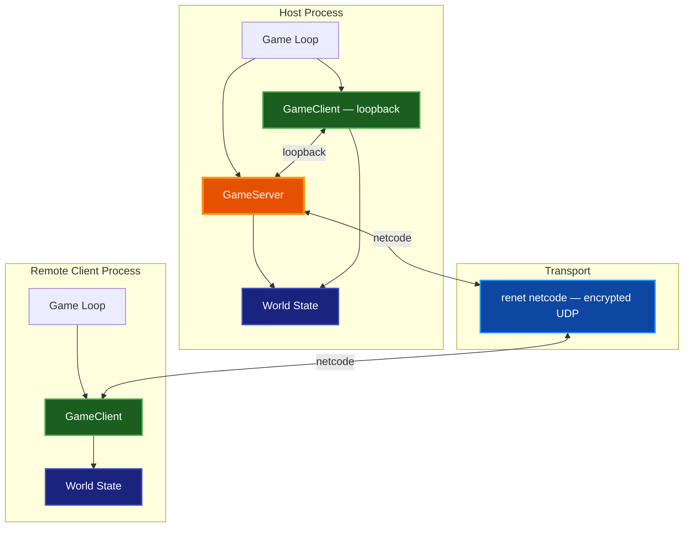
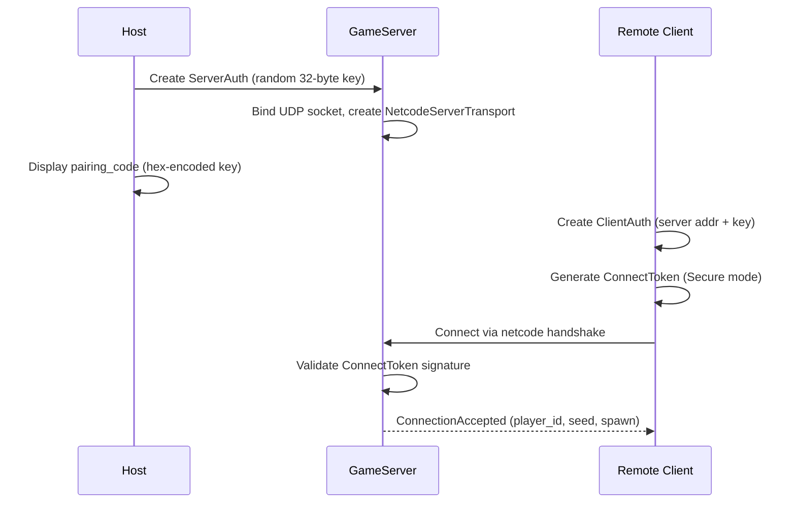
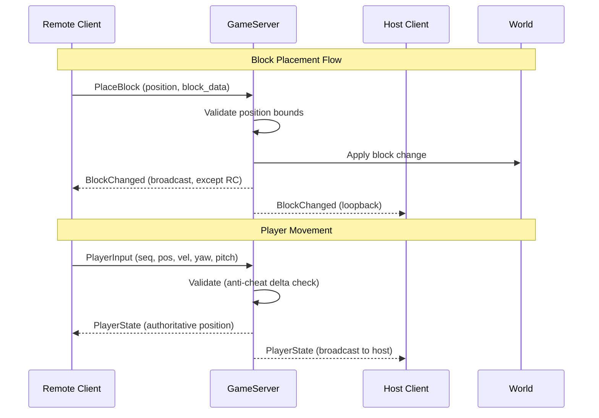
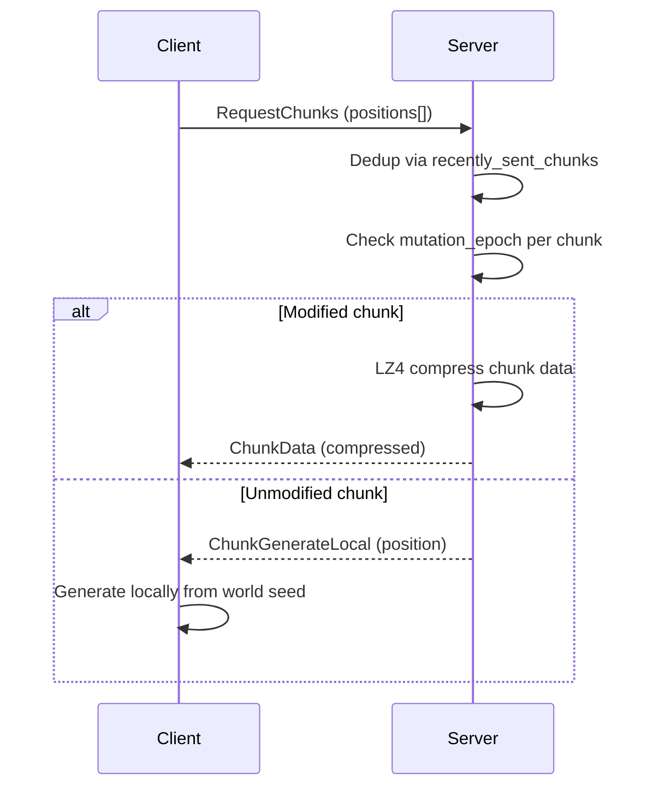

# Networking

Multiplayer architecture for Voxel World — encrypted UDP networking via renet/netcode with per-subsystem sync modules, server-authoritative physics, and client-side prediction.

## Table of Contents

- [Overview](#overview)
- [Getting Started](#getting-started)
- [Architecture](#architecture)
- [Authentication](#authentication)
- [Channels](#channels)
- [Protocol Messages](#protocol-messages)
- [Host-Client Model](#host-client-model)
- [LAN Discovery](#lan-discovery)
- [Sync Subsystems](#sync-subsystems)
- [Security](#security)
- [Configuration](#configuration)
- [Troubleshooting](#troubleshooting)
- [Related Documentation](#related-documentation)

## Overview

**Purpose:** Voxel World supports multiplayer sessions for up to 4 players over LAN or the internet. The host runs both a `GameServer` and a loopback `GameClient`, while remote clients connect over the network.

**Key design goals:**

- Server-authoritative world state with client-side prediction for responsive movement
- Per-subsystem sync modules for block changes, fluids, physics, and gameplay features
- Secure encrypted UDP transport via renet netcode with per-session keys
- Bandwidth-aware chunk streaming with LZ4 compression and epoch-based dedup
- Unified typed event queue replacing individual pending-message vectors

**Tech stack:** renet (reliable/unreliable multiplexed channels), renet_netcode (encrypted UDP transport), bincode (serialization), LZ4 (chunk compression)

## Getting Started

### Host a Game

```bash
make run-host    # Start as LAN host on default port
```

The host console displays a pairing code (64 hex characters). Remote clients need this code when connecting in Secure mode.

### Join a Game

```bash
make run-client  # Join LAN host
```

The client discovers LAN servers automatically via UDP broadcast. Enter the host's pairing code when prompted.

### Reset State

```bash
make reset-host    # Reset host-side save/state
make reset-client  # Reset client-side save/state
```

## Architecture



### Source Layout

The networking module lives in `src/net/` with these key files:

| File | Purpose |
|------|---------|
| `server.rs` | `GameServer` — client management, broadcasting, validation |
| `client.rs` | `GameClient` — connection, message send/receive |
| `auth.rs` | `ServerAuth` / `ClientAuth` — key generation, transport creation |
| `channel.rs` | `Channel` enum and renet channel configuration |
| `protocol.rs` | `ClientMessage` / `ServerMessage` enums and all wire types |
| `discovery.rs` | LAN server discovery via UDP broadcast |
| `block_sync.rs` | Block change broadcasting and validation |
| `chunk_sync.rs` | Priority-based chunk loading with cancellation |
| `player_sync.rs` | Client-side prediction and server reconciliation |
| `fluid_sync.rs` | Water/lava cell sync throttling |
| `water_sync.rs` | Water-specific sync optimizer |
| `lava_sync.rs` | Lava-specific sync optimizer |
| `falling_block_sync.rs` | Falling block spawn/land events |
| `tree_fall_sync.rs` | Whole-tree fall events (batched) |
| `day_cycle_sync.rs` | Time-of-day and pause state |
| `extended_gameplay_sync.rs` | Stencils, templates, pictures, doors |
| `texture_slots.rs` | Custom texture upload and slot management |
| `picture_store.rs` | Picture storage for picture frames |
| `server_thread.rs` | Optional threaded server (feature-gated) |

The multiplayer state orchestrator is in `src/app_state/multiplayer.rs`.

## Authentication



The authentication system uses renet netcode's **Secure mode** with per-session encryption keys:

- **Server** generates a random 32-byte private key at startup via `ServerAuth::new()`
- **Loopback client** (the host's own client) receives the key directly via `GameClient::with_key()`
- **Remote clients** obtain the key out-of-band via a hex-encoded pairing code displayed on the host console
- `PROTOCOL_ID` is a compile-time FNV-1a hash of the version string `"voxel-world-2"`, ensuring mismatched binaries fail at the netcode handshake
- `PROTOCOL_SCHEMA_VERSION` (currently `2`) is an application-level version check sent in `ConnectionAccepted` — clients refuse to continue if it doesn't match their compile-time value

**Connection timeout:** 30 seconds — generous enough to survive frame stalls from chunk generation and GPU uploads without the netcode layer expiring the connection.

## Channels

Messages are multiplexed over four channels, each with delivery guarantees matched to the data type:

| Channel | ID | Delivery | Budget | Use Case |
|---------|-----|----------|--------|----------|
| `PlayerMovement` | 0 | **Unreliable** | 5 MB | Position/velocity updates (~20/sec). Dropped packets acceptable — latest state matters most |
| `BlockUpdates` | 1 | **Reliable Unordered** | 10 MB | Block place/break. Must arrive, order doesn't matter |
| `GameState` | 2 | **Reliable Ordered** | 5 MB | Join/leave, time sync, chat. Must arrive in sequence |
| `ChunkStream` | 3 | **Reliable Unordered** | 8 MB | Chunk data. Must not be lost (holes in world), order irrelevant |

The connection budget is 60 KB per tick at 60 Hz (~28.8 Mbps theoretical throughput).

## Protocol Messages

All messages use bincode serialization for speed and compactness. A size limit of 8 MB (`MAX_INBOUND_MESSAGE_SIZE`) prevents OOM from hostile peers.

### Client → Server

| Message | Channel | Description |
|---------|---------|-------------|
| `PlayerInput` | PlayerMovement | Predicted position/velocity, input actions, sequence number |
| `PlaceBlock` | BlockUpdates | World position + block data |
| `BreakBlock` | BlockUpdates | World position |
| `BulkOperation` | BlockUpdates | Fill, Replace, or Template with bounds validation |
| `RequestChunks` | ChunkStream | Up to 1024 chunk positions |
| `ConsoleCommand` | GameState | Server-side command string (max 512 chars) |
| `UploadModel` | GameState | Custom model (LZ4 compressed, max 2 MB) |
| `UploadTexture` | GameState | Custom texture PNG (64x64, max 128 KB) |
| `UploadPicture` | GameState | Picture PNG for frames (max 1 MB) |
| `PlaceWaterSource` | BlockUpdates | Water bucket placement |
| `PlaceLavaSource` | BlockUpdates | Lava bucket placement |
| `ToggleDoor` | BlockUpdates | Door open/close with both halves |
| `SetPlayerName` | GameState | Display name change (max 32 chars) |
| `ChatMessage` | GameState | Chat text (max 256 chars) |
| `RequestTexture` | GameState | Request a texture by slot index |

### Server → Client

| Message | Channel | Description |
|---------|---------|-------------|
| `ConnectionAccepted` | GameState | Player ID, seed, spawn pos, tick rate, protocol version |
| `ConnectionRejected` | GameState | Rejection reason |
| `PlayerState` | PlayerMovement | Authoritative position for reconciliation |
| `BlockChanged` | BlockUpdates | Single block change notification |
| `BlocksChanged` | BlockUpdates | Batch block changes (bulk operations) |
| `ChunkData` | ChunkStream | LZ4-compressed full chunk |
| `ChunkGenerateLocal` | ChunkStream | Instruction to generate chunk from seed (unmodified) |
| `PlayerJoined` | GameState | New player notification with name and position |
| `PlayerLeft` | GameState | Player disconnect notification |
| `TimeUpdate` | GameState | Time of day (0.0–1.0) |
| `DayCyclePauseChanged` | GameState | Pause state + current time |
| `SpawnPositionChanged` | GameState | New spawn point |
| `ModelRegistrySync` | GameState | Full model + door-pair registry (LZ4) |
| `ModelAdded` | GameState | New custom model announcement |
| `TextureData` | GameState | Texture PNG response |
| `TextureAdded` | GameState | New texture slot announcement |
| `WaterCellsChanged` | BlockUpdates | Batch water cell updates (throttled 2–5 Hz) |
| `LavaCellsChanged` | BlockUpdates | Batch lava cell updates (throttled 2–5 Hz) |
| `FallingBlockSpawned` | BlockUpdates | Falling block entity spawn |
| `FallingBlockLanded` | BlockUpdates | Falling block entity landing |
| `TreeFell` | BlockUpdates | Batch tree fall event (all blocks at once) |
| `StencilLoaded` | GameState | Stencil data (LZ4 compressed) |
| `StencilTransformUpdate` | GameState | Stencil position/rotation change |
| `StencilRemoved` | GameState | Stencil deletion |
| `TemplateLoaded` | GameState | Template data (LZ4 compressed) |
| `TemplateRemoved` | GameState | Template deletion |
| `PictureAdded` | GameState | New picture announcement |
| `FramePictureSet` | GameState | Picture frame assignment |
| `DoorToggled` | BlockUpdates | Door state change |
| `PlayerNameChanged` | GameState | Name change notification |
| `ChatReceived` | GameState | Chat message broadcast |

## Host-Client Model

The host runs both a `GameServer` and a loopback `GameClient` connected to itself. This architecture means:

- The host's world is authoritative — all block changes, physics, and fluid sim run on the host
- The host's client receives its own broadcasts as `NetworkEvent` messages through the normal pipeline
- Remote clients are pure consumers — they send inputs and receive authoritative state



### Dual Player Tracking

`GameServer` tracks players in two structures:

- `players: HashMap<u64, PlayerInfo>` — remote clients
- `host_player: Option<PlayerInfo>` — the host's own player, updated via `update_host_player()` each frame (not through anti-cheat)

### Originator-Excluded Broadcasts

`broadcast_encoded_except(channel, label, msg, exclude_client_id)` sends to all clients except one. This prevents echoing actions back to the originating client.

### Epoch-Aware Chunk Dedup

`recently_sent_chunks` tracks `(sent_time, mutation_epoch)` per client per chunk position. Re-sending is skipped when the epoch hasn't changed and the resend window (30 seconds) hasn't expired. This prevents redundant chunk traffic when multiple clients request the same chunk.

### Unified Event Queue

`MultiplayerState` uses a single `VecDeque<NetworkEvent>` instead of individual `Vec<T>` fields per message type. Typed helpers (`take_pending_blocks`, `take_pending_chunks`, etc.) extract only the variants they care about, preserving ordering within each category.

## LAN Discovery

Server discovery uses a separate UDP broadcast protocol on port 5001:

1. **Client** broadcasts a discovery request with magic bytes `VXLD`
2. **Server** responds with a `ServerAnnouncement` containing game port, name, player count, and capacity
3. **Client** maintains a list of discovered servers, removing stale entries after 5 seconds

Discovery runs independently from the game connection — it uses a simple UDP socket, not the renet transport.

## Sync Subsystems

### Chunk Streaming



Key optimizations:

- **Unmodified chunks** skip serialization entirely — the client generates them locally from the shared seed
- **LZ4 compression** with per-chunk `mutation_epoch` caching avoids re-compressing the same chunk for multiple clients
- **Priority-based loading** ensures nearby chunks arrive first
- **Epoch-based cancellation** stops in-flight chunk generation on origin shifts

### Player Movement

Client-side prediction with server reconciliation:

1. Client sends `PlayerInput` every frame with predicted position and a sequence number
2. Server validates the position (anti-cheat delta check), applies it, and responds with authoritative `PlayerState`
3. Client reconciles by replaying unacknowledged inputs on top of the server state
4. **Idle delta skipping** — the client skips sending near-identical inputs but forces a keep-alive every N frames

### Block Changes

- **Server-authoritative** — clients send place/break requests, server validates and broadcasts
- **Originator exclusion** — the client that triggered the change doesn't receive the echo
- **Bulk operations** (Fill, Replace, Template) are validated server-side with a 32³ volume cap and queued for frame-distributed processing
- **Block validation** includes coordinate bounds checks (Y: 0–511, X/Z: ±30M)

### Fluid Sync

Water and lava use **throttled batch updates** at 2–5 Hz:

- Server collects changed fluid cells each tick
- Changes are batched into `WaterCellsChanged` / `LavaCellsChanged` messages
- Optimizers in `water_sync.rs` and `lava_sync.rs` reduce redundant cell updates

### Falling Blocks and Tree Falls

- **Falling blocks**: Server sends `FallingBlockSpawned` when a block loses support and `FallingBlockLanded` when it comes to rest
- **Tree falls**: Batched into a single `TreeFell` message containing all blocks, which is more bandwidth-efficient than individual spawn messages
- Entity IDs are allocated from a persistent counter to prevent ID reuse on retransmissions

### Extended Gameplay

Stencils, templates, pictures, and doors sync through the `GameState` channel:

- **Stencils**: Load → transform updates → removal (LZ4 compressed data)
- **Templates**: Load → removal (LZ4 compressed `.vxt` files)
- **Pictures**: Upload → add announcement → frame assignment
- **Doors**: Toggle with both halves validated and broadcast atomically

## Security

### Transport Security

- **Encrypted UDP** via renet netcode Secure mode with per-session 32-byte keys
- **ConnectToken** signed by the server's private key — clients without the key cannot connect
- **Protocol ID** is a compile-time FNV-1a hash, rejecting mismatched binaries at handshake
- **Schema version** check after connection — clients with wrong `PROTOCOL_SCHEMA_VERSION` are disconnected

### Input Validation

Every inbound `ClientMessage` is validated after deserialization:

- **Coordinate bounds**: Y in [0, 511], X/Z within ±30M
- **Size limits**: Uploads capped (models 2 MB, textures 128 KB, pictures 1 MB)
- **String limits**: Names 32 chars, chat 256 chars, commands 512 chars
- **Bulk volume cap**: Fill/Replace limited to 32³ blocks
- **Path traversal**: Template names reject `..`, `/`, `\`, control characters
- **Float validation**: `PlayerInput` rejects NaN/Infinity
- **Rate limiting**: Per-client sliding window for chat and console commands

### Anti-Cheat

- Server validates all block positions and rejects out-of-bounds edits
- Remote client positions are checked for unrealistic delta movement
- Host bypasses anti-cheat validation (known trusted source)
- First position update from a new client gets a free pass (spawn teleport)

## Configuration

| Constant | Default | Location | Description |
|----------|---------|----------|-------------|
| `DEFAULT_PORT` | `5000` | `net/mod.rs` | Game server UDP port |
| `DISCOVERY_PORT` | `5001` | `net/discovery.rs` | LAN discovery broadcast port |
| `MAX_PLAYERS` | `4` | `net/mod.rs` | Maximum concurrent players |
| `TICK_RATE` | `20` | `net/mod.rs` | Server updates per second |
| `CONNECTION_TIMEOUT_MS` | `30000` | `net/auth.rs` | Netcode connection timeout |
| `CHUNK_RESEND_WINDOW` | `30s` | `net/server.rs` | Chunk dedup window |
| `MAX_INBOUND_MESSAGE_SIZE` | `8 MB` | `net/protocol.rs` | Bincode decode size limit |
| `MAX_BULK_FILL_VOLUME` | `32768` | `net/protocol.rs` | Max blocks in a Fill/Replace |
| `SERVER_TIMEOUT_SECS` | `5` | `net/discovery.rs` | LAN discovery entry TTL |

### Runtime Environment Variables

| Variable | Purpose |
|----------|---------|
| `PROTOCOL_SCHEMA_VERSION` | Wire-schema version — must match between client and server |

## Troubleshooting

### Client Cannot Connect

1. Verify the host is running and the pairing code matches
2. Check that port 5000 (game) and 5001 (discovery) are not blocked by firewall
3. Confirm both clients run the same binary version — protocol version mismatch causes handshake rejection

### Desync / Teleport Warnings

- The server's anti-cheat rejects large position deltas from remote clients
- If you see frequent teleport corrections, check network latency or increase tolerance
- Host players bypass anti-cheat checks by design

### Chunk Holes

- Missing chunks indicate lost `ChunkData` packets — the reliable-unordered channel should prevent this
- Check that `CHUNK_RESEND_WINDOW` (30s) hasn't expired if clients join during heavy chunk generation
- Verify `MAX_REQUEST_CHUNKS` (1024) isn't being exceeded by the client's view distance

### High Bandwidth Usage

- Fluid sync is throttled to 2–5 Hz by default
- Chunk streaming uses LZ4 compression with epoch-based dedup
- Check `NetStats` on the debug HUD for per-type bandwidth breakdown

## Related Documentation

- [Architecture](ARCHITECTURE.md) — Overall system design and module organization
- [Quick Start](QUICKSTART.md) — Building and running the game
- [World Edit](WORLD_EDIT.md) — Block editing and creative tools
- [CLI](CLI.md) — Command-line options including multiplayer flags
