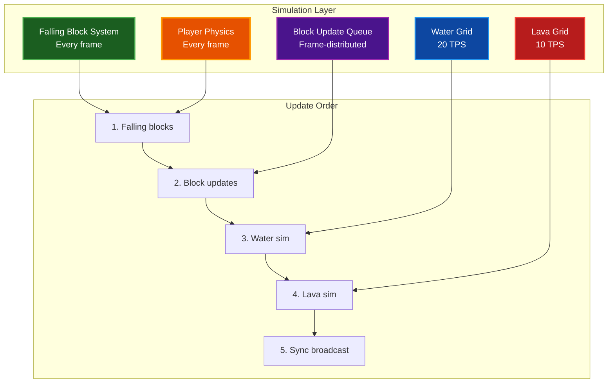
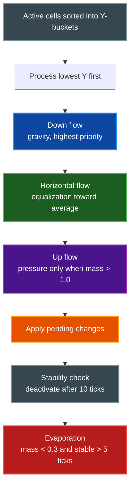
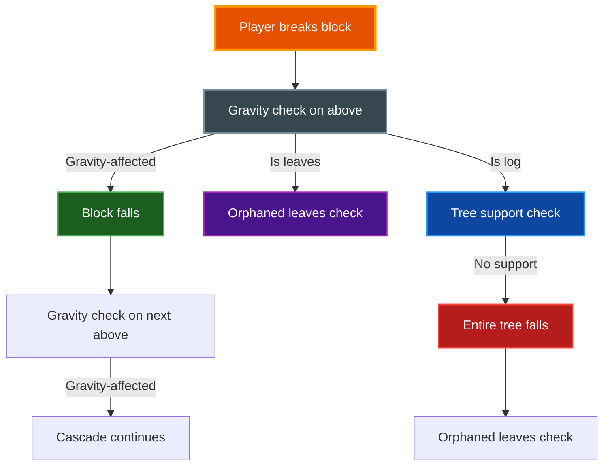

# Physics Systems

Overview of the voxel engine's simulation systems: fluids, falling blocks, tree mechanics, block update propagation, and player physics.

## Table of Contents
- [Overview](#overview)
- [Architecture](#architecture)
- [Fluid Simulation](#fluid-simulation)
  - [Water](#water)
  - [Lava](#lava)
  - [Fluid Interactions](#fluid-interactions)
- [Falling Blocks](#falling-blocks)
- [Block Update Queue](#block-update-queue)
- [Tree Mechanics](#tree-mechanics)
- [Player Physics](#player-physics)
- [Model Ground Support](#model-ground-support)
- [Multiplayer Synchronization](#multiplayer-synchronization)
- [Performance](#performance)
- [Related Documentation](#related-documentation)

## Overview

The engine runs several physics systems concurrently, each with its own tick rate and performance budget:

- **Fluid simulation** — cellular automata for water and lava with pressure, flow, and evaporation
- **Falling blocks** — gravity-affected blocks (sand, gravel, snow) that detach and fall as entities
- **Block update queue** — frame-distributed propagation of gravity checks, tree support, and orphaned leaf detection
- **Tree mechanics** — connected-tree detection, ground support validation, and cascade falling
- **Player physics** — gravity, collision, swimming, and mud movement modifiers

All physics is **server-authoritative** in multiplayer. The host runs both the server simulation and a loopback client; remote clients receive state via sync messages.

## Architecture

The `WorldSim` struct in `app_state/simulation.rs` owns all physics state: the `World`, `FallingBlockSystem`, `BlockUpdateQueue`, `WaterGrid`, `LavaGrid`, and `ParticleSystem`.

## Fluid Simulation

Both water and lava use a **W-Shadow cellular automata** approach: each cell has a floating-point `mass` (0.0–1.0), and flow is computed per-tick toward lower-mass neighbors.

### Water

Water uses a sparse `WaterGrid` stored as a `HashMap<Position, WaterCell>`. Only cells that are actively flowing consume simulation time.

**Key types:**
- `WaterCell` — mass, display mass (smoothed for rendering), source flag, water type, stable tick counter
- `WaterGrid` — sparse grid with active cell tracking, double-buffered pending changes, reusable buffers
- `WaterType` — Ocean, Lake, River, Swamp, Spring (affects horizontal flow rate)

**Simulation algorithm:**

**Flow priority:**

1. **Down** (gravity) — fills the cell below to `MAX_MASS + MAX_COMPRESS`. Undamped when falling into air; damped when filling into existing water to prevent oscillation.
2. **Horizontal** (equalization) — flows toward neighbors with lower mass at the average rate, scaled by `FLOW_DAMPING` and water type multiplier.
3. **Up** (pressure) — only when remaining mass exceeds `MAX_MASS`. Scaled by `FLOW_DAMPING`.

**Water types affect horizontal flow speed:**

| Water Type | Flow Multiplier | Use Case |
|---|---|---|
| River | 1.5x | Fast-moving waterways |
| Ocean | 1.0x | Default |
| Spring | 1.0x | Source blocks |
| Lake | 0.7x | Standing water |
| Swamp | 0.3x | Viscous, slow-moving |

**Terrain water activation:**

Terrain water (lakes, oceans) is static by default. When a player breaks a block adjacent to terrain water, `activate_adjacent_terrain_water()` converts neighboring `Water` blocks into active `WaterGrid` source cells.

**Waterlogging:**

Model blocks can become waterlogged when water flows into them (sets `data.waterlogged = true`).

### Lava

Lava uses the same cellular automata pattern but with higher viscosity and simpler rules.

**Key differences from water:**

- **No upward flow** — lava never flows up against gravity
- **Horizontal flow only on solid** — lava only spreads horizontally if the block below is solid, creating natural pooling
- **Much higher viscosity** — `FLOW_DAMPING` is 0.25 (vs water's 0.8)
- **Slower tick rate** — 10 TPS (vs water's 20 TPS)
- **Smaller budget and radius** — 128 updates/frame within 48 blocks

### Fluid Interactions

Water and lava interact when their cells occupy adjacent positions:

- **Water + Lava** → Cobblestone — both fluid cells are removed and a solid block is placed
- Checked after every simulation tick for all changed positions and their neighbors

## Falling Blocks

Blocks affected by gravity detach from the grid and become `FallingBlock` entities that simulate real-time physics.

**Gravity-affected block types:**
- `Sand`
- `Gravel`
- `Snow`

**Key types:**
- `FallingBlock` — entity ID, position, velocity, block type, age
- `FallingBlockSystem` — manages all active falling blocks, handles spawn/remove/update
- `GpuFallingBlock` — POD struct for GPU shader rendering

**Simulation:**

- **Gravity:** 20.0 blocks/s² (same as player gravity)
- **Update:** Every frame using `delta_time`, not tick-based
- **Collision:** Checks the block below on the Y axis; lands when solid ground is reached
- **Max capacity:** 256 active falling blocks — excess spawns are silently dropped
- **Despawn:** Blocks below Y=-64 are destroyed
- **Cascade:** After a block lands, the block above it is queued for a gravity check, enabling sand/gravel tower collapse

**Landed block processing:**

`process_landed_blocks()` sorts landed blocks by Y (lowest first) and scans upward for the first valid placement position. After placing, it queues a `BlockUpdateType::Gravity` check for the block above.

## Block Update Queue

The `BlockUpdateQueue` is a priority-based, frame-distributed system that propagates physics consequences after a block changes.

**Update types:**

| Type | Trigger | Effect |
|---|---|---|
| `Gravity` | Block below removed | Gravity-affected block detaches as `FallingBlock` |
| `TreeSupport` | Block below a log removed | Checks if connected tree has ground support; if not, entire tree falls |
| `OrphanedLeaves` | Log removed or tree fell | Checks if leaf cluster still has a log connection; if not, leaves fall |
| `ModelGroundSupport` | Block below a model removed | Unsupported models (torches, fences, gates) break with particles |

**Priority system:**

Updates are prioritized by distance squared from the player — closer blocks are processed first. A deduplication `HashSet` prevents the same (position, type) pair from being queued twice. Items become re-queueable after processing.

**Frame distribution:**

`take_batch()` removes up to `max_per_frame` items from the heap each frame. This prevents FPS spikes from large cascades (e.g., a tall sand tower or a large tree).

**Cascade behavior:**

## Tree Mechanics

Trees are detected and validated using flood-fill algorithms in `world/tree_logic.rs`.

**Tree block types:**
- **Logs:** `Log`, `PineLog`, `WillowLog`, `BirchLog`
- **Leaves:** `Leaves`, `PineLeaves`, `WillowLeaves`, `BirchLeaves`

**Connected tree detection (`find_connected_tree`):**

BFS flood fill using 26-directional neighbors with connectivity rules:
- Logs connect orthogonally to other logs and leaves
- Leaves connect diagonally to other leaves but only orthogonally to logs
- This prevents merging separate nearby trees into one connected component

**Ground support validation (`tree_has_ground_support`):**

Checks if any log in the connected tree has a solid, non-tree-part block below it. If no log has ground support, the entire tree falls as individual `FallingBlock` entities.

**Orphaned leaf detection (`find_leaf_cluster_and_check_log`):**

BFS from a leaf position — 26-directional for leaf-to-leaf, 6-directional for leaf-to-log check. Returns the full leaf cluster and whether any log connection exists.

## Player Physics

Player physics vary based on the medium the player is in and the current movement mode.

**Modes:**
- **Walking** — gravity and collision always active
- **Flying** — no gravity, collision optional

**Medium modifiers:**

| Medium | Gravity | Buoyancy | Drag | Effect |
|---|---|---|---|---|
| Air | 20.0 | — | — | Normal gameplay |
| Water | 4.0 | 2.0 | 0.85 | Reduced gravity, buoyancy, swimming |
| Mud | 2.0 | 1.0 | 0.7 | Heavy drag, slow movement |

**Swimming:** Press space to swim upward in water. The combination of reduced gravity and buoyancy creates natural buoyant movement.

**Collision:** AABB collision detection against world blocks, resolved independently per axis to prevent tunneling and allow sliding along walls.

## Model Ground Support

Model blocks that require ground support break when the block below them is removed or destroyed.

**Supported model types:**
- Torches
- Fences
- Gates
- Doors, stairs, glass panes
- Vegetation and cave decorations

When a model breaks due to lost support:
1. `ParticleSystem::spawn_block_break()` creates visual particle effects
2. The block is removed from the world
3. A `ModelGroundSupportBreakEvent` is emitted for multiplayer sync

The `ModelRegistry::requires_ground_support(model_id)` method determines per-model-type whether support is required.

## Multiplayer Synchronization

All physics is server-authoritative. The host runs the simulation; remote clients receive state updates via network messages.

### Fluid Sync

A generic `FluidSyncOptimizer<T>` provides delta-encoded updates with three optimization layers:

1. **Delta encoding** — Only sends cells with mass change ≥ 5%. First appearance and removal always sent.
2. **Area of Interest filtering** — Only sends updates within 128 blocks of connected players.
3. **Rate limiting** — Maximum 5 broadcasts per second, 256 updates per broadcast.

### Falling Block Sync

- **Server** — runs `FallingBlockSystem::update()`, sends spawn/land messages
- **Client** — renders falling blocks from network messages using the same `GRAVITY` constant for interpolation

### Tree Fall Sync

`TreeFallSync` batches tree falls into messages of at most 80 blocks to stay under the 1500-byte MTU. Large trees are split across multiple messages.

## Performance

### Simulation Budgets

| System | Tick Rate | Updates/Frame | Radius | Performance Notes |
|---|---|---|---|---|
| Water | 20 TPS (50ms) | 1024 | 64 blocks | Y-bucket sort for O(n) drain order |
| Lava | 10 TPS (100ms) | 128 | 48 blocks | Sort by Y then distance |
| Falling blocks | Every frame | 256 max | Unlimited | Frame-based with delta time |
| Block updates | Every frame | Configurable | Unlimited | Priority queue, frame-distributed |

### Optimization Techniques

- **Y-bucket sorting** — water active cells sorted into 512 Y-indexed buckets for O(n) drain-order processing
- **Stability tracking** — cells that haven't changed for N ticks are deactivated (water: 10, lava: 15)
- **Double-buffered writes** — fluid pending changes prevent read-write conflicts during simulation
- **Lazy pruning** — water grid prunes empty entries only when cell count exceeds `PRUNE_THRESHOLD` (2048)
- **Frame-distributed updates** — block update queue processes a fixed batch per frame to prevent FPS spikes
- **Reusable buffers** — `WaterGrid` and `LavaGrid` pre-allocate buffers for changed positions, sync updates, and lava checks

### Quality Presets

Water simulation can be toggled off via `Settings.water_simulation_enabled`. Potato and Low quality presets disable water simulation entirely.

## Related Documentation

- [ARCHITECTURE.md](ARCHITECTURE.md) — Overall system design and coordinate systems
- [QUICKSTART.md](QUICKSTART.md) — Getting started with the engine
- [WORLD_EDIT.md](WORLD_EDIT.md) — Block placement and world editing
