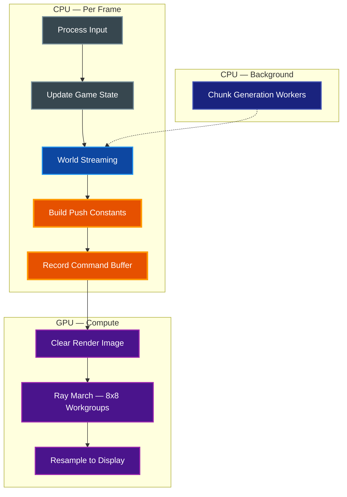
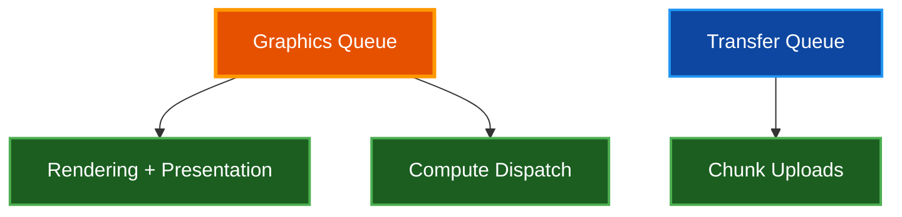
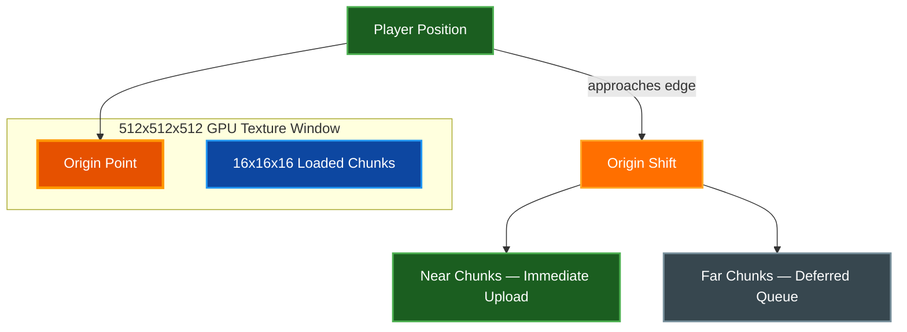
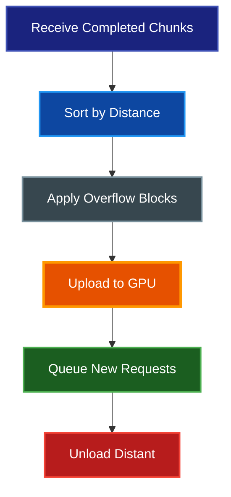
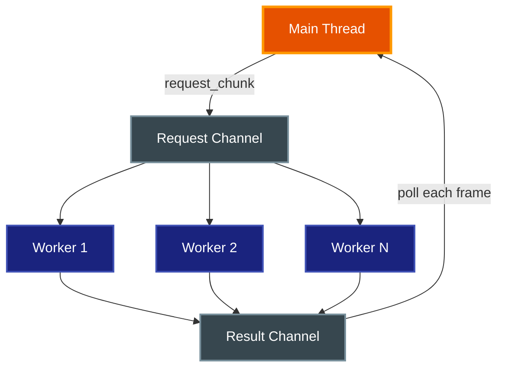
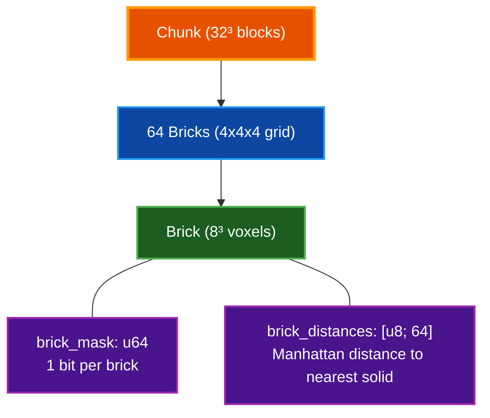
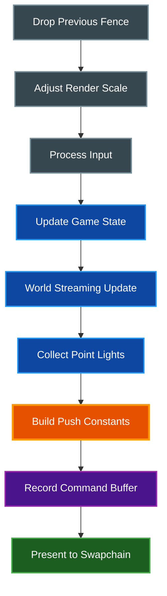
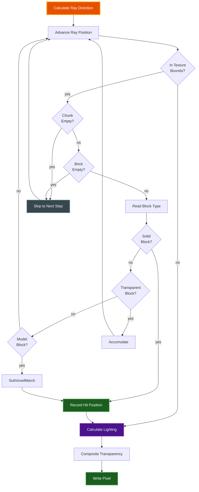
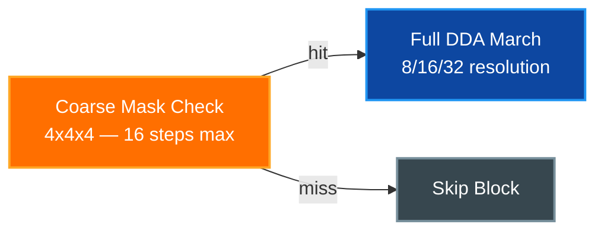
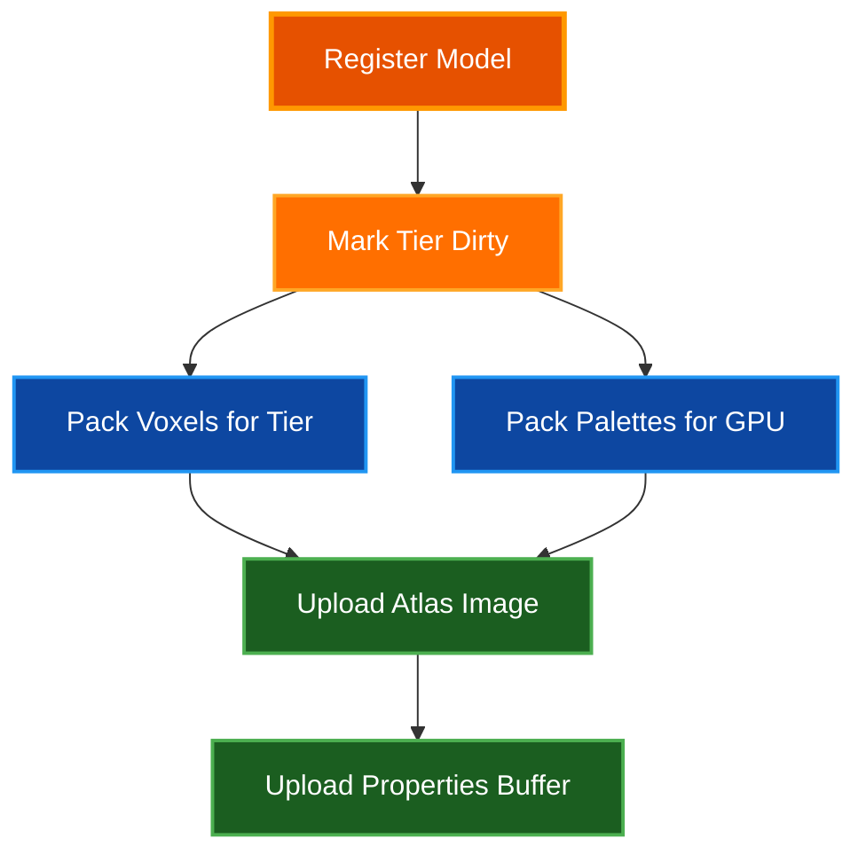

# Rendering Pipeline

Technical documentation for the voxel-world rendering system — a pure compute-shader ray marching engine built on Vulkan, with no traditional rasterization pipeline.

## Table of Contents

- [Overview](#overview)
- [Architecture](#architecture)
- [Vulkan Initialization](#vulkan-initialization)
- [GPU Resources](#gpu-resources)
- [World Streaming](#world-streaming)
- [Chunk Loading](#chunk-loading)
- [Sparse Voxel Tree](#sparse-voxel-tree-svt)
- [Render Loop](#render-loop)
- [Compute Shaders](#compute-shaders)
  - [Ray Marching (traverse.comp)](#ray-marching-traversecond)
  - [Acceleration Structures (accel.glsl)](#acceleration-structures-accelglsl)
  - [Materials (materials.glsl)](#materials-materialsglsl)
  - [Sub-Voxel Models (models.glsl)](#sub-voxel-models-modelsglsl)
  - [Lighting (lighting.glsl)](#lighting-lightingglsl)
  - [Display Resampling (resample.comp)](#display-resampling-resamplecond)
- [Render Modes](#render-modes)
- [Sub-Voxel Model System](#sub-voxel-model-system)
- [Performance Characteristics](#performance-characteristics)
- [Environment Variables](#environment-variables)
- [Related Documentation](#related-documentation)

## Overview

**Purpose:** Describe the complete rendering pipeline from world storage through GPU compute to screen display.

**Key design decisions:**

- Pure compute-shader rendering — no vertex buffers, no rasterization, no fixed-function graphics pipeline
- Single compute shader (`traverse.comp`) performs DDA ray marching through a 3D voxel texture
- A sliding-window 3D texture (512x512x512) maps a fixed GPU buffer onto an infinite world
- Two-level acceleration structure (chunk flags + brick masks) skips empty space efficiently
- Dynamic render resolution adjusts automatically to maintain target frame rate

## Architecture

### End-to-End Data Flow


### Rendering Pipeline Stages



## Vulkan Initialization

**File:** `src/vulkan_context.rs`

### Device Selection

The engine selects a physical device meeting these requirements:

- Vulkan 1.3 (or `khr_dynamic_rendering` extension)
- Swapchain support (`khr_swapchain`)
- Portability subset (`khr_portability_subset`)
- Queue family with `GRAPHICS` + presentation support

Device preference order: discrete GPU > integrated > virtual > CPU.

### Queue Setup



On discrete GPUs, a dedicated DMA transfer queue is used for chunk uploads. On unified memory architectures (Apple Silicon), the graphics queue handles both roles and buffer ownership transfers are skipped.

### Memory Allocators

All GPU memory allocation uses Vulkano's `StandardMemoryAllocator` with these patterns:

| Pattern | Usage | Flags |
|---------|-------|-------|
| Device-local storage | Voxel texture, render image | Default |
| Host-coherent storage | Metadata buffers (brick masks, distances, chunk bits) | `PREFER_HOST` + `HOST_RANDOM_ACCESS` |
| Host-visible staging | Upload ring buffers | `HOST_SEQUENTIAL_WRITE` |

## GPU Resources

**File:** `src/gpu_resources.rs`, `src/app_state/graphics.rs`

### Primary Buffers and Images

| Resource | Format | Size | Purpose |
|----------|--------|------|---------|
| Voxel texture | R8_UINT 3D | 512x512x512 (128 MB) | Block type storage |
| Render image | RGBA8 2D | Dynamic (render scale) | Ray march output |
| Texture atlas | RGBA8 2D | 2880x64 | Block textures (45 tiles) |
| Custom atlas | RGBA8 2D | Variable | Painted/picture block textures |
| Model atlases | R8_UINT 3D | Three tiers | Sub-voxel model voxel data |
| Palette atlas | RGBA8 2D | 256x32 | Shared model palettes |
| chunk_bits | Storage buffer | 4096 bytes | Per-chunk empty/loaded flag |
| brick_masks | Storage buffer | 262 KB | 64-bit mask per chunk |
| brick_distances | Storage buffer | 262 KB | Distance field per chunk |

### Descriptor Set Layout

Eight descriptor sets bind all GPU resources to the compute shaders:

| Set | Binding | Type | Contents |
|-----|---------|------|----------|
| 0 | 0 | Storage image | Render target (RGBA8) |
| 1 | 0–1 | Sampler + sampled image | Texture atlases (main + custom) |
| 2 | 0 | Uniform texel buffer | Voxel data (R8_UINT 3D) |
| 3 | 0 | Storage buffer | Particle data |
| 4 | 0 | Storage buffer | Point light data |
| 5 | 0–3 | Storage buffers | chunk_bits, brick_masks, brick_distances, block_custom_data |
| 6 | 0 | Storage image | Model atlas (tiered: 8/16/32) |
| 7 | 0–2 | Mixed | model_palettes, model_properties, model_metadata |

### Push Constants

The `PushConstants` struct in `src/gpu_resources.rs` is the primary per-frame communication mechanism. It contains approximately 120 fields grouped into:

- **Camera** — inverse projection-view matrix, position, direction
- **Texture mapping** — origin offset, dimensions, chunk size
- **Render settings** — mode, AO/shadow/point-light toggles, LOD distances
- **Lighting** — sun direction, ambient color, sky gradient, fog parameters
- **Animation** — frame counter, water time, wave time, head bob
- **Block positions** — world positions of emissive blocks (lava, glowstone, crystal, etc.)
- **Measurement** — start/end points for the measurement tool

All fields are copied into the shader's push constant block via `build_push_constants()` in `src/app/render.rs`.

### Transfer Ring Buffer

A 6-slot ring buffer manages asynchronous GPU uploads with bounded memory:

```rust
struct TransferRingBuffer {
    staging_buffers: Vec<Option<Arc<StagingBuffer>>>,
    head: AtomicUsize,  // oldest in-flight upload
    tail: AtomicUsize,  // next upload slot
    capacity: usize,    // 6
}
```

Each frame, completed staging buffers are reclaimed via `pop_completed()`. New uploads block if all 6 slots are in-flight, preventing unbounded staging memory growth.

## World Streaming

**File:** `src/world_streaming.rs`

The world streaming system manages the sliding-window 3D texture that maps a fixed 512x512x512 GPU buffer onto an infinite voxel world.

### Sliding Window Model



The texture origin tracks the player. When the player approaches the edge, the origin shifts and the texture content is remapped.

### Origin Shift Procedure

Origin shifts use **predictive direction-aware thresholds**:

- Moving toward the edge: shift at 1/6 of texture size (aggressive)
- Moving away from the edge: shift at 1/4 of texture size (relaxed)

The shift procedure:

1. Calculate new origin (clamped to prevent negative coordinates)
2. Mark all chunks as dirty for re-upload at new positions
3. Bump the chunk loader epoch — stale in-flight chunks are discarded
4. Partition chunks into **near** (within load distance, immediate upload) and **far** (deferred)
5. Clear far-region voxels on GPU asynchronously
6. Re-initialize CPU-side metadata buffers

### Chunk Upload Pipeline

Per-frame processing in `update_chunk_loading()`:



1. **Receive** completed chunks from background workers (bounded by `MAX_COMPLETED_UPLOADS_PER_FRAME = 64`)
2. **Sort** by distance from player — nearest chunks upload first
3. **Apply overflow** blocks from neighboring chunks (two-pass: apply all overflow, then insert)
4. **Upload** voxel data to the 3D texture and update SVT metadata
5. **Queue** new chunk requests for generation (bounded by `CHUNKS_PER_FRAME = 8`)
6. **Unload** chunks beyond `UNLOAD_DISTANCE`, clearing their GPU regions

### Metadata Buffer Flush

The CPU-side metadata mirrors (`chunk_bits`, `brick_masks`, `brick_distances`) are flushed to GPU in a specific order:

1. Write `brick_masks` buffer
2. Write `brick_distances` buffer
3. Write `chunk_bits` buffer **last**

This ordering ensures the shader sees complete brick data before a chunk is marked as loaded.

### Epoch-Based Stale Rejection

Each origin shift increments a global epoch. Chunk requests include the epoch at request time. Completed chunks with a stale epoch are silently discarded — their data would map to incorrect texture coordinates.

## Chunk Loading

**File:** `src/chunk_loader.rs`

### Thread Pool Architecture



- Worker count: `(physical_cores - 1).max(2)`, overridable via `CHUNK_WORKER_THREADS` env var
- Bounded request channel prevents unbounded queue growth
- Each worker creates its own `ParallelStorageReader` for concurrent disk I/O
- Workers use `recv_timeout(20ms)` for responsive shutdown

### Worker Output

Each `ChunkResult` includes:

- The generated `Chunk` data (32x32x32 blocks)
- Pre-computed `SvtMetadata` (brick mask + distance field) — computed on the worker thread to avoid main-thread overhead
- The request epoch for stale rejection

## Sparse Voxel Tree (SVT)

**File:** `src/svt.rs`

The SVT is a two-level acceleration structure that enables efficient empty-space skipping during ray marching.

### Structure



Each chunk contains 64 bricks (4x4x4 grid, each brick 8x8x8 voxels):

- **brick_mask** — 64-bit bitmask, one bit per brick (1 = non-empty, 0 = all air)
- **brick_distances** — per-brick Manhattan distance to the nearest non-empty brick (0 for solid bricks, 1–255 for empty)

### Distance Field Computation

`calculate_brick_distances()` uses multi-pass BFS-like Manhattan distance propagation:

1. Initialize: non-empty bricks get distance 0, empty bricks get 255
2. Forward pass (6 directions): for each empty brick, `min(dist, neighbor + 1)`
3. Backward pass (6 directions): catches distances propagated in the opposite direction

### Memory Efficiency

| Chunk Type | SVT Size | Flat Size | Savings |
|------------|----------|-----------|---------|
| All-air | ~72 bytes | 32,768 bytes | 456x |
| Single block | ~584 bytes | 32,768 bytes | 56x |
| Dense | ~32,700 bytes | 32,768 bytes | Minimal |

## Render Loop

**Files:** `src/app/render.rs`, `src/app/update.rs`

### Frame Pipeline



1. **Drop previous frame fence** — allows GPU to reuse resources from N frames ago (pipelining)
2. **Dynamic render scale** — smooth FPS-based resolution adjustment to maintain target frame rate
3. **Process input** — mouse, keyboard, UI events
4. **Update game state** — physics, player movement, block interactions
5. **Update world streaming** — load/unload chunks, upload to GPU
6. **Collect point lights** — gather emissive block positions from the world
7. **Build push constants** — assemble the ~120-field struct from current game state
8. **Record command buffer** — dispatch compute shaders, present

### Command Buffer Recording

The `record_and_submit_frame()` function records a single command buffer each frame:

1. Clear render image to black
2. Bind traverse compute pipeline
3. Bind all 8 descriptor sets
4. Push constants
5. Dispatch `(width/8, height/8, 1)` workgroups (8x8 local size)
6. Pipeline barrier (compute → compute)
7. Bind resample compute pipeline
8. Resample render image to swapchain (area-weighted box filter)
9. Submit with fence, present to swapchain

## Compute Shaders

### Ray Marching (traverse.comp)

**File:** `shaders/traverse.comp`

The primary rendering shader. Uses DDA (Digital Differential Analyzer) ray marching through the 3D voxel texture.

#### Three-Pass Structure

| Pass | `pass_mode` | Resolution | Purpose |
|------|-------------|------------|---------|
| Distance | 1 | 1/4 | Build distance hint buffer for beam optimization |
| Main | 2 | Full | Primary march using distance hint to skip empty space |
| Default | 0 | Full | Full-resolution march without distance hint |

#### Workgroup Execution

- Local size: 8x8 threads (64 threads per workgroup)
- Each thread processes one pixel
- At workgroup start, all threads cooperatively load `s_chunk_flags[]` into shared memory

#### Ray Marching Algorithm



Each ray step performs:

1. Convert ray position to texture coordinates
2. Check texture bounds — rays exiting the texture sample sky/fog
3. `isChunkEmpty()` — check shared memory chunk flags (fast, ~1 cycle)
4. `isBrickEmpty()` — check storage buffer brick mask (storage buffer read)
5. `readBlockType()` — read R8 value from 3D texture
6. Handle block type:
   - **Solid** — record hit, break from loop
   - **Water/Glass/TintedGlass** — accumulate transparency, continue
   - **Model** — coarse mask check + `marchSubVoxelModel()`
   - **Air** — continue stepping

#### Transparency Layering

Transparent blocks are composited in a fixed order:

1. Water (deepest) — animated UV scrolling with caustics
2. Glass — partial transparency
3. Tinted glass (topmost) — color-tinted transparency

This ordering ensures correct visual layering regardless of encounter order along the ray.

### Acceleration Structures (accel.glsl)

**File:** `shaders/accel.glsl`

Two-level empty-space skipping that dramatically reduces texture reads:

**Level 1 — Chunk flags (`s_chunk_flags`):**

Loaded cooperatively into shared memory at workgroup start. Each thread checks a single byte to determine if an entire 32x32x32 region is empty. Avoids per-ray global memory reads.

**Level 2 — Brick masks (`brick_masks` storage buffer):**

64-bit mask per chunk. Each bit represents one 8x8x8 brick. The bit index is computed from the brick position within the chunk. Empty bricks are skipped entirely.

**Distance field (`brick_distances`):**

Per-brick Manhattan distance to the nearest non-empty brick. Currently used for single-chunk sphere tracing, enabling large skips through empty regions.

### Materials (materials.glsl)

**File:** `shaders/materials.glsl`

Handles texture sampling and material property lookups.

#### Texture Atlas Sampling

The main texture atlas contains 45 tiles at 64x64 pixels each, arranged horizontally (2880x64 total). `blockTypeToAtlasIndex()` maps block types to tile positions:

- Most block types map directly: `Stone → 1, Dirt → 2, Grass → 3`
- Special slots: index 17 = `grass_side`, index 18 = `log_top` (no direct BlockType)
- A second custom atlas serves painted and picture blocks

#### Emissive Block Properties

| Block | Color | Intensity |
|-------|-------|-----------|
| Lava | Orange-red | 0.8 |
| Glowstone | Warm white | 0.5 |
| Glow Mushroom | Cyan | 0.4 |
| Crystal | White-blue | 0.6 |

#### Water Rendering

Water uses animated UV scrolling with per-type tint colors:

| Water Type | Tint |
|------------|------|
| Ocean | Deep blue |
| Lake | Medium blue |
| River | Light blue |
| Swamp | Murky green |
| Spring | Clear blue |

#### Ambient Occlusion

4-sample corner AO for each solid block hit:

- Samples read neighboring blocks from the 3D texture
- Chunk boundary early-exit avoids out-of-bounds reads
- AO darkens corners and edges for depth perception

#### Painted Block Blending

Painted blocks support 5 blend modes: Multiply, Overlay, Soft Light, Screen, Color Only. The paint color is applied via HSV color space conversion.

### Sub-Voxel Models (models.glsl)

**File:** `shaders/models.glsl`

Sub-voxel models are ray-marched within a single block using a tiered atlas system.

#### Three-Tier Atlas

| Tier | Resolution | Atlas | Models |
|------|------------|-------|--------|
| Low | 8x8x8 | `modelAtlas8` | 32 slots |
| Medium | 16x16x16 | `modelAtlas16` | 32 slots |
| High | 32x32x32 | `modelAtlas32` | 32 slots |

`sampleModelVoxel()` reads the correct atlas based on `model_properties[model_id].resolution`.

#### Two-Tier Collision



1. **Coarse mask** — 4x4x4 collision mask ray test, max 16 iterations. Fast rejection for clearly empty space.
2. **Full march** — DDA through the model's actual resolution with transparency accumulation.

#### Model Transforms

Models support rotation and positioning transforms:

- `transformFramePos()` — Apply frame position/rotation
- `inverseTransformFramePosition()` / `inverseTransformFrameDirection()` — Reverse transform for ray-model intersection
- `rotateModelPos()` — Rotate model-space position
- `inverseRotateNormal()` — Rotate surface normal back to world space

#### Shared Palette System

Models share palettes via a deduplication table:

- `getModelPaletteId()` — Look up palette from model properties
- `getModelPaletteColor()` — Sample from the shared 256x32 RGBA palette atlas

### Lighting (lighting.glsl)

**File:** `shaders/lighting.glsl`

#### Shadow Ray Casting

`castShadowRayInternal()` performs full shadow ray marching with the same chunk/brick acceleration as primary rays:

- Partial blockers: water transmits 60%, glass transmits 80%
- Tinted glass produces colored shadows
- Early termination when cumulative transmission drops below threshold
- Distance-based LOD: fewer steps for shadows from distant geometry

#### Sky Exposure

`getSkyExposure()` casts a vertical ray to determine ambient light:

- Accumulates partial blockers (water, glass, leaves)
- Result multiplied with ambient light for under-tree and underwater darkening

#### Point Lights

`calculatePointLights()` accumulates contributions from all active point lights:

- Distance-based attenuation
- Culling: lights beyond a cutoff distance are skipped
- Source: emissive blocks (lava, glowstone, crystal, glow mushroom)

### Display Resampling (resample.comp)

**File:** `shaders/resample.comp`

Area-weighted box filter that scales the render image to display resolution. Each output pixel computes the weighted average of all input pixels overlapping with it, handling non-integer scaling ratios correctly. This enables dynamic render resolution without visual artifacts.

## Render Modes

**File:** `src/render_mode.rs`

The engine supports several visualization modes, toggled at runtime:

| Mode | Value | Output |
|------|-------|--------|
| Coord | 0 | Texture coordinate visualization |
| Steps | 1 | Ray march step count (performance profiling) |
| Textured | 2 | Default full-color rendering |
| Normal | 3 | Surface normals |
| UV | 4 | Texture UV coordinates |
| Depth | 5 | Depth buffer visualization |
| BrickDebug | 6 | Brick boundary overlay |
| ShadowDebug | 7 | Shadow map visualization |

The mode is passed via push constants and checked in `traverse.comp` to select the output color computation path.

## Sub-Voxel Model System

**Files:** `src/sub_voxel/types.rs`, `src/sub_voxel/registry.rs`

### Model Resolution

| Resolution | Dimensions | Voxels | Usage |
|------------|-----------|--------|-------|
| Low | 8x8x8 | 512 | Built-in models (torches, fences, doors) |
| Medium | 16x16x16 | 4,096 | Detailed built-ins |
| High | 32x32x32 | 32,768 | Custom user models |

### Model ID Allocation

| Range | Type | Count |
|-------|------|-------|
| 0 | Empty/placeholder | 1 |
| 1 | Torch | 1 |
| 2–3 | Slabs | 2 |
| 4–19 | Fence variants | 16 |
| 20–27 | Gate variants | 8 |
| 28–38 | Stair variants | 11 |
| 39–98 | Door/window variants | 60 |
| 99 | Crystal | 1 |
| 100–118 | Vegetation | 19 |
| 119–150 | Glass pane variants | 32 |
| 176–255 | Custom user models | 80 |

### Palette Deduplication

The `PaletteTable` in `registry.rs` deduplicates palettes across models:

- 256 palette slots with reference counting
- Multiple models can share a palette
- Orphan reclamation: when a palette's ref count reaches zero, its slot is available for reuse

### GPU Upload Flow



Incremental updates: `dirty_model_ids` and `dirty_palette_ids` track changes since the last GPU sync, avoiding full atlas repacks.

## Performance Characteristics

### GPU Hot Paths

Per-frame, per-ray operations ordered by cost:

| Operation | Approximate Cost | Frequency |
|-----------|-----------------|-----------|
| Chunk empty check | ~1 cycle | Every step |
| Brick empty check | ~10–100 cycles | When chunk non-empty |
| Block type read | ~50–200 cycles | When brick non-empty |
| Ambient occlusion | 4 texture reads | Per solid hit |
| Shadow ray | Full DDA traversal | Per solid hit (1–2 rays) |

### CPU-Side Budgets

| Budget | Default | Purpose |
|--------|---------|---------|
| `MAX_COMPLETED_UPLOADS_PER_FRAME` | 64 | Chunks uploaded to GPU per frame |
| `CHUNKS_PER_FRAME` | 8 | New chunk generation requests per frame |
| Metadata flush | Amortized | Dirty-flag triggered over multiple frames |

### GPU Memory Layout

| Resource | Size | Notes |
|----------|------|-------|
| Voxel texture | 128 MB | Never reallocated; content overwritten on origin shift |
| Staging ring | 6 slots | Bounded async upload memory |
| Metadata buffers | ~525 KB | Host-coherent for CPU-side writes |
| Model atlases | Variable | Three tiers, incrementally updated |
| Palette atlas | ~32 KB | 256x32 RGBA, incrementally updated |

### Key Optimizations

- **Shared memory chunk flags** — loaded once per workgroup, not per ray
- **Brick mask skipping** — eliminates texture reads for 95%+ of empty space
- **Zero-slice skip** — avoids staging buffer copies for all-zero metadata regions
- **Z-adjacent chunk merging** — adjacent chunks at same (y, x) merged into single `BufferImageCopy` region
- **Thread-local staging pools** — `STAGING_POOL` + `TRANSFER_RING` reuse HOST-visible buffers across uploads
- **Pre-warmed staging** — `prewarm_staging_pool()` at init ensures first origin shift never pays cold-alloc cost
- **Dynamic render resolution** — automatic scaling to maintain target FPS

## Environment Variables

Runtime-tunable parameters for performance profiling:

| Variable | Default | Purpose |
|----------|---------|---------|
| `ORIGIN_SHIFT_PROFILE` | off | Per-shift timing output for profiling |
| `ORIGIN_SHIFT_NEAR_RADIUS` | `view_distance` | Sync-upload radius on origin shift |
| `METADATA_CHUNKS_PER_FRAME` | 128 | SVT metadata rebuilds per frame |
| `METADATA_RESET_BUDGET` | 256 | Per-frame budget during metadata reseed |
| `REUPLOAD_PER_FRAME` | 256 | Chunks drained from reupload queue per frame |
| `UPLOADS_PER_FRAME` | 256 | Dirty chunks uploaded to GPU per frame |
| `CHUNK_WORKER_THREADS` | `(cores-1).max(2)` | Background chunk generation threads |

## Related Documentation

- [ARCHITECTURE.md](ARCHITECTURE.md) — Overall system design and module organization
- [PHYSICS.md](PHYSICS.md) — Fluid simulation, gravity, and block update systems
- [QUICKSTART.md](QUICKSTART.md) — Building and running the engine
- [CLI.md](CLI.md) — Command-line options and quality presets
- [DOCUMENTATION_STYLE_GUIDE.md](DOCUMENTATION_STYLE_GUIDE.md) — Documentation standards
