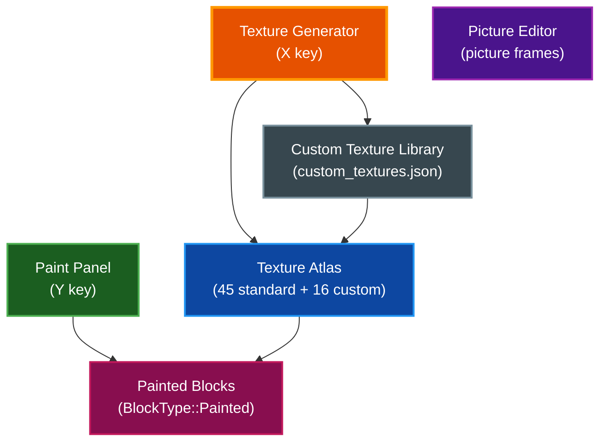
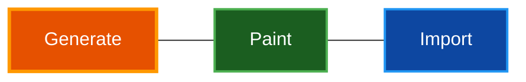
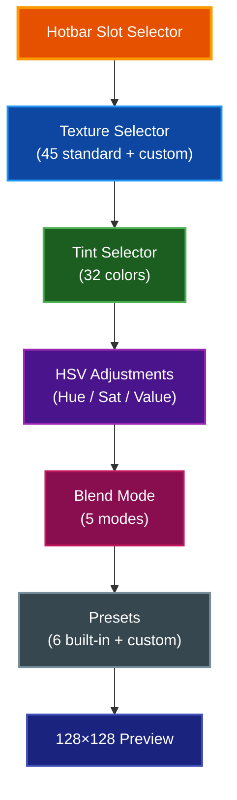

# Texture Editor

In-game texture creation system with procedural generation, pixel painting, and image import (press **X** to open). Includes a paint customization panel for tinting and blending (press **Y**), plus a picture frame editor for in-world artwork.

## Table of Contents

- [Overview](#overview)
- [Opening and Closing](#opening-and-closing)
- [Texture Generator Tabs](#texture-generator-tabs)
- [Generate Tab](#generate-tab)
- [Paint Tab](#paint-tab)
- [Import Tab](#import-tab)
- [Paint Customization Panel](#paint-customization-panel)
- [Picture Editor](#picture-editor)
- [Custom Texture Library](#custom-texture-library)
- [Painted Blocks](#painted-blocks)
- [Multiplayer Texture Slots](#multiplayer-texture-slots)
- [Keyboard Shortcuts](#keyboard-shortcuts)
- [Troubleshooting](#troubleshooting)
- [Related Documentation](#related-documentation)

## Overview

Voxel World provides three interconnected editing tools for textures and visual customization:

| Tool | Key | Purpose |
|------|-----|---------|
| **Texture Generator** | X | Create textures via procedural patterns, pixel painting, or image import |
| **Paint Panel** | Y | Customize painted blocks with tints, blend modes, and HSV adjustments |
| **Picture Editor** | *(via picture frames)* | Create 2D artwork displayed on in-world picture frames |

## Opening and Closing

### Texture Generator (X key)

- **Open**: Press **X** during gameplay. The cursor is released for UI interaction.
- **Close**: Press **X** again or **Escape**. The cursor is recaptured for gameplay.

### Paint Customization Panel (Y key)

- **Open**: Press **Y** during gameplay.
- **Close**: Press **Y** again or **Escape**.

Both panels can be open simultaneously. Escape closes the topmost panel first.

## Texture Generator Tabs

The Texture Generator window (500×600px) has three tabs:

| Tab | Purpose |
|-----|---------|
| **Generate** | Procedural texture creation from 16 built-in patterns |
| **Paint** | Pixel-level painting on a variable-size canvas |
| **Import** | Load and convert external images to textures |

## Generate Tab

Create textures procedurally from parameterized patterns.

### Patterns

| Pattern | Description |
|---------|-------------|
| Solid | Single flat color |
| HorizontalStripes | Alternating horizontal bands |
| VerticalStripes | Alternating vertical bands |
| DiagonalStripes | Angled stripe pattern |
| Checkerboard | Classic alternating squares |
| GradientH | Horizontal color gradient |
| GradientV | Vertical color gradient |
| GradientRadial | Circular gradient from center |
| Noise | Random noise pattern (seedable) |
| Brick | Brick wall pattern with mortar lines |
| Dots | Repeating dot grid |
| Grid | Crosshatch grid lines |
| Diamond | Diamond tile pattern |
| Herringbone | V-shaped brick pattern |
| Crosshatch | Overlapping diagonal lines |
| Waves | Sinusoidal wave pattern |

### Controls

| Control | Range | Purpose |
|---------|-------|---------|
| **Name** | Text field | Name for the saved texture |
| **Pattern** | Dropdown | Select from 16 patterns |
| **Color 1 / Color 2** | Color pickers | Pattern colors with preset swatches |
| **Scale** | 0.25× – 4× | Pattern detail size (logarithmic) |
| **Rotation** | 0° / 90° / 180° / 270° | Pattern rotation |
| **Seed** | Integer + Random | Noise pattern seed |
| **Preview** | 128×128 | Live preview of the pattern |

### Actions

| Button | Behavior |
|--------|----------|
| **Save** | Save current settings to the texture list |
| **Delete** | Remove the selected texture from the list |
| **Save Library** | Write all textures to `custom_textures.json` |
| **Copy to Canvas** | Copy the preview to the Paint tab canvas for pixel editing |

## Paint Tab

Pixel-level painting on a variable-size canvas with nine tools.

### Canvas Sizes

Preset dimensions available via buttons at the top:

| Preset | Dimensions |
|--------|------------|
| Small | 32×32, 16×128, 32×128, 128×32 |
| Medium | 64×64, 32×64, 64×32 |
| Large | 128×128, 64×128, 128×64 |
| Custom | Any dimensions from 1 to 128 per axis |

Default canvas is 64×64 at 2× zoom.

### Tools

| Tool | Icon | Behavior |
|------|------|----------|
| **Pencil** | ✏ | Draw single pixels |
| **Brush** | 🖌 | Circular brush (1–8 pixel radius) |
| **Eraser** | 🧹 | Erase to transparent |
| **Fill** | 🪣 | Flood fill connected area (4-way) |
| **Eyedropper** | 💉 | Pick color from canvas (finds closest palette entry) |
| **Line** | ╱ | Straight line via Bresenham's algorithm |
| **Rectangle** | ▢ | Draw filled or outlined rectangle |
| **Circle** | ○ | Draw filled or outlined circle/ellipse |
| **Text** | T | Draw text using built-in 5×7 bitmap font |

### Shape Tools

Line, Rectangle, and Circle show a **live preview** during drag. The shape mode toggle switches between **Filled** and **Outline** rendering.

### Text Tool

The text tool uses a built-in 5×7 bitmap font supporting ASCII characters 32–90 (space through Z). Three size presets:

| Size | Scale | Pixel Height |
|------|-------|-------------|
| S | 1× | 7px |
| M | 2× | 14px |
| L | 3× | 21px |

A blinking cursor indicates the text placement position. Click to place text at multiple locations.

### Mirror Mode

Toggle **X** and **Y** mirror for symmetric painting:

| Active Axes | Replication |
|-------------|-------------|
| X only | 2× (vertical axis flip) |
| Y only | 2× (horizontal axis flip) |
| Both | 4× (quad symmetry) |

Mirror axis indicators appear on the canvas as colored lines.

### Canvas Controls

| Control | Options | Purpose |
|---------|---------|---------|
| **Zoom** | 1×, 2×, 4×, 8× | Canvas magnification |
| **Grid** | On/Off | Pixel grid overlay (shown at zoom ≥ 2×) |
| **Undo/Redo** | Buttons | Up to 100 undo / 50 redo states |
| **Clear** | Button | Clear entire canvas to transparent |

### Canvas Palette

32-color indexed palette displayed as a 4×8 grid:

| Slots | Colors |
|-------|--------|
| 0 | Transparent |
| 1–5 | White, Black, Gray, Light Gray, Dark Gray |
| 6–12 | Red, Green, Blue, Yellow, Magenta, Cyan, Orange |
| 13–15 | Purple, Pink, Brown |
| 16–20 | Forest Green, Teal, Maroon, Navy, Olive |
| 21–31 | Stone, Dirt, Wood, Dark Olive, Tan, Sandy Brown, Rosy Brown, Powder Blue, Plum, Beige, Slate Gray |

Left-click a swatch to select it. The RGB editor below the grid allows fine adjustment of the selected color.

### Canvas Output

| Button | Behavior |
|--------|----------|
| **Save as Texture** | Save canvas to a custom texture slot |
| **Export as Picture** | Save canvas as a picture frame image with configurable dimensions |
| **Save Library** | Persist all custom textures |

## Import Tab

Load external images and convert them to block textures.

### Import Controls

| Control | Options | Purpose |
|---------|---------|---------|
| **Browse** | File dialog | Select an image file |
| **Resize Mode** | Fit / Fill / Stretch / Crop | How the image maps to 64×64 |
| **Crop Offset** | X/Y sliders | Pan the crop region (Crop mode only) |
| **Sample Filter** | Nearest / Bilinear / Lanczos | Pixel interpolation quality |

### Resize Modes

| Mode | Behavior |
|------|----------|
| **Fit** | Scale to fit within 64×64, maintaining aspect ratio (padding with transparency) |
| **Fill** | Scale to fill 64×64, maintaining aspect ratio (crops overflow) |
| **Stretch** | Stretch to exactly 64×64 (may distort) |
| **Crop** | Crop a 64×64 region from the original, no scaling |

### Preview

A 128×128 preview with checkerboard transparency background shows the import result. Click **Apply to Canvas** to copy the imported image to the Paint tab for further editing.

## Paint Customization Panel

The Paint Panel (Y key, 320×480px) customizes how painted blocks appear in the world by combining a base texture with tint color, blend mode, and HSV adjustments.

### UI Sections

### Texture Selector

Dropdown listing all 45 standard atlas textures plus any custom textures. The selected texture becomes the base for the painted block.

### Tint Selector

32-color tint palette displayed as a color swatch with an index slider (0–31). Tints include Red, Orange, Yellow, Lime, Green, Teal, Cyan, Sky Blue, Blue, Purple, Magenta, Pink, White, Light Gray, Dark Gray, Brown, and more.

### HSV Adjustments

| Parameter | Range | Effect |
|-----------|-------|--------|
| **Hue** | -180° to +180° | Shift the color hue |
| **Saturation** | 0.0× to 2.0× | Increase or decrease color intensity |
| **Value** | 0.0× to 2.0× | Brighten or darken |

Each slider has an individual reset button, plus a **Reset All HSV** button.

### Blend Modes

Five blend modes control how the tint color combines with the base texture:

| Mode | Description |
|------|-------------|
| **Multiply** | Tint color multiplied with texture color (darkens) |
| **Overlay** | Enhances contrast while preserving highlights and shadows |
| **Soft Light** | Gentle highlight and shadow adjustment |
| **Screen** | Lightens the result (`1 - (1-base) × (1-blend)`) |
| **Color Only** | Applies tint hue and saturation, keeps texture luminance |

### Presets

Six built-in presets provide starting points:

| Preset | Effect |
|--------|--------|
| Stone Gray | Neutral stone appearance |
| Warm Wood | Warm brown wood tones |
| Cool Brick | Cool-toned brick color |
| Aged Stone | Weathered stone look |
| Vibrant Red | Intense red coloring |
| Pure Tint | Full tint application |

Save custom presets with a name (up to 64 presets total). Non-built-in presets can be deleted.

### Preview

A 128×128 CPU-rendered preview shows the final result of texture × tint × blend mode × HSV adjustment before applying to the hotbar.

## Picture Editor

A separate 2D editor for creating artwork displayed on in-world picture frames. Entered through the picture frame UI (not a keyboard shortcut).

### Tools

| Tool | Key | Description |
|------|-----|-------------|
| Pencil | P | Single pixel drawing |
| Eraser | E | Erase to transparent |
| Fill | G | Flood fill connected area |
| Eyedropper | I | Pick color from canvas |
| Line | L | Draw straight line (click-click placement) |
| Rectangle | R | Draw rectangle (click-click placement) |
| Circle | C | Draw circle (click-click placement) |

### Canvas Features

- Variable brush size (1–16 pixels)
- Fill or outline toggle for shapes
- Zoom: 0.5× to 32× with pan support
- Non-square canvases up to `MAX_PICTURE_SIZE`
- 32-color palette plus a custom RGB color (palette index 32)
- Image import with crop and scale
- Up to 50 undo states

Two-point tools (Line, Rectangle, Circle) use click-click placement — click once for the start point, click again for the end point.

## Custom Texture Library

Up to **16 custom textures** are stored in `custom_textures.json` with pixel data in separate PNG files (`custom_texture_0.png` through `custom_texture_15.png`).

| Property | Value |
|----------|-------|
| Maximum textures | 16 |
| Texture dimensions | 64×64 pixels |
| Storage format | PNG per texture + JSON metadata |
| Atlas indices | 128–143 (slot index OR'd with `0x80`) |

Custom textures integrate into the standard texture atlas alongside the 45 built-in textures. They appear in the Paint Panel texture selector and can be used for painted blocks.

## Painted Blocks

Painted blocks (`BlockType::Painted = 18`) are the in-game result of texture customization. Each painted block stores:

| Field | Type | Range | Purpose |
|-------|------|-------|---------|
| `texture_idx` | u8 | 0–44 (standard) or 128–143 (custom) | Atlas texture index |
| `tint_idx` | u8 | 0–31 | Tint palette color |
| `blend_mode` | u8 | 0–4 | How tint combines with texture |

Paint data is stored per-block in chunk metadata. This makes painted blocks more memory-intensive than standard block types — use dedicated `BlockType` variants for world generation rather than painted blocks.

### Placing Painted Blocks

1. Open the Paint Panel (**Y**) and configure texture, tint, blend mode, and HSV
2. Click **Apply to Slot** to assign to the selected hotbar slot
3. Place the block in the world — it renders with the combined appearance
4. **Middle-click** an existing painted block to copy its texture and tint settings to the current hotbar slot

## Multiplayer Texture Slots

In multiplayer, custom textures are managed through a server-side slot system.

| Property | Value |
|----------|-------|
| Maximum server slots | 32 |
| Maximum file size | 128 KiB per texture |
| Storage format | `slot_NN.png` + `metadata.json` |
| Reference tracking | Blocks using each slot are counted |

The server uses reference counting — a texture slot cannot be deleted while any blocks reference it. Textures are written atomically (temp file + rename) to prevent corruption. The client side uses a request-if-needed cache pattern to avoid redundant uploads.

## Keyboard Shortcuts

| Shortcut | Action |
|----------|--------|
| `X` | Toggle Texture Generator |
| `Y` | Toggle Paint Customization Panel |
| `Escape` | Close active panel |
| `P` *(picture editor)* | Pencil tool |
| `E` *(picture editor)* | Eraser tool |
| `G` *(picture editor)* | Fill tool |
| `I` *(picture editor)* | Eyedropper tool |
| `L` *(picture editor)* | Line tool |
| `R` *(picture editor)* | Rectangle tool |
| `C` *(picture editor)* | Circle tool |

## Troubleshooting

### Custom texture not appearing in the world

- Verify the texture was saved to the library via **Save Library**
- Check that custom texture slots are not full (maximum 16)
- Ensure the Paint Panel is applying the custom texture (not a standard one) to the hotbar slot

### Painted block looks wrong

- Confirm the blend mode produces the desired effect — try **Color Only** for a clean tint
- Check HSV adjustments are not shifted unexpectedly — use **Reset All HSV**
- Verify the tint index is correct (0–31)

### Imported image is distorted

- Try **Fit** mode to preserve aspect ratio with padding
- Use **Crop** mode to select a specific region without distortion
- Switch to **Lanczos** filter for higher quality downscaling

### Canvas painting is too slow

- Reduce brush size for the Brush tool
- Lower the canvas resolution (32×32 instead of 128×128)
- Disable the grid overlay at high zoom levels

## Related Documentation

- [Model Editor](MODEL_EDITOR.md) — Sub-voxel 3D model editor
- [Architecture](ARCHITECTURE.md) — Overall system design including texture atlas
- [Quickstart](QUICKSTART.md) — Getting started with voxel-world
- [CLI](CLI.md) — Command-line options and keybindings
