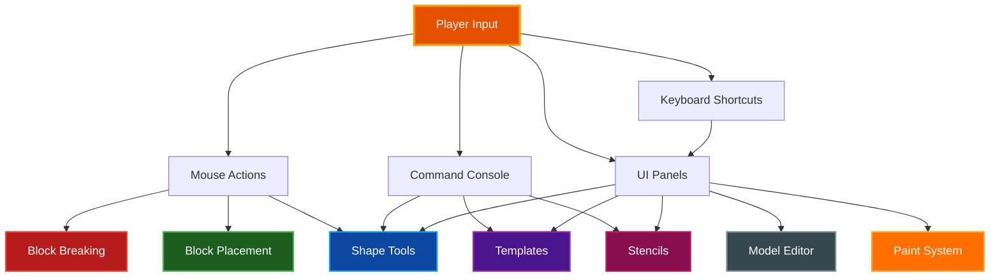
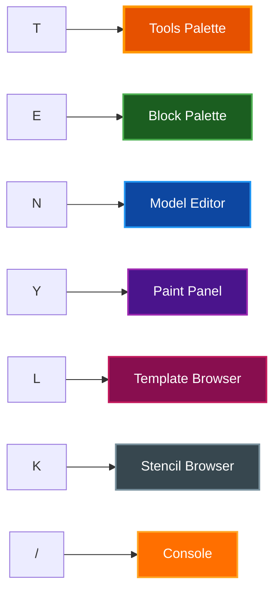
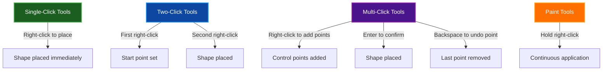
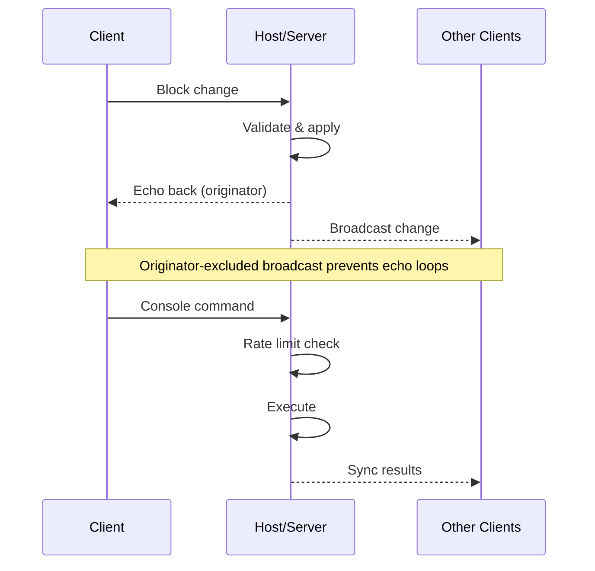

# World Editing Tools

Comprehensive guide to all world editing tools, commands, and building systems in Voxel World. Covers block placement/breaking, shape tools, templates, stencils, the model editor, console commands, and paint customization.

## Table of Contents

- [Overview](#overview)
- [Quick Reference](#quick-reference)
  - [Keybindings](#keybindings)
  - [UI Panels](#ui-panels)
- [Block Placement and Breaking](#block-placement-and-breaking)
  - [Breaking Blocks](#breaking-blocks)
  - [Placing Blocks](#placing-blocks)
  - [Placement Priority](#placement-priority)
  - [Line-Lock Building](#line-lock-building)
- [Hotbar and Palette](#hotbar-and-palette)
  - [Hotbar](#hotbar)
  - [Block Palette](#block-palette)
  - [Paint Panel](#paint-panel)
- [Shape Tools](#shape-tools)
  - [Tool List](#tool-list)
  - [Tool Interaction Patterns](#tool-interaction-patterns)
  - [Mirror Tool](#mirror-tool)
- [Templates](#templates)
  - [Selecting a Region](#selecting-a-region)
  - [Saving and Loading](#saving-and-loading)
  - [Placing Templates](#placing-templates)
- [Stencils](#stencils)
- [Sub-Voxel Model Editor](#sub-voxel-model-editor)
  - [Editor Tools](#editor-tools)
  - [Mirror Axes](#mirror-axes)
  - [Undo and Redo](#undo-and-redo)
  - [Model Library](#model-library)
- [Console Commands](#console-commands)
  - [World Manipulation](#world-manipulation)
  - [Teleportation and Navigation](#teleportation-and-navigation)
  - [Template and Stencil Commands](#template-and-stencil-commands)
  - [Texture Management](#texture-management)
  - [Utility Commands](#utility-commands)
  - [Relative Coordinates](#relative-coordinates)
- [Block-Specific Behavior](#block-specific-behavior)
  - [Doors and Trapdoors](#doors-and-trapdoors)
  - [Fences and Gates](#fences-and-gates)
  - [Stairs](#stairs)
  - [Glass Panes](#glass-panes)
  - [Painted Blocks](#painted-blocks)
  - [Tinted Glass and Crystals](#tinted-glass-and-crystals)
- [Multiplayer Editing](#multiplayer-editing)
- [Related Documentation](#related-documentation)

## Overview

Voxel World provides a complete creative-mode building environment with multiple complementary systems for world editing:



**Key features:**
- **30+ console commands** with autocomplete, history, and confirmation prompts
- **24 GUI shape tools** for geometric building
- **Template system** for saving and reusing building regions
- **Stencil system** for holographic building guides
- **Sub-voxel model editor** for custom 3D block models
- **Paint system** with HSV adjustments, blend modes, and presets
- **Mirror tool** for symmetrical building
- **Multiplayer sync** for all editing operations

## Quick Reference

### Keybindings

#### Global Shortcuts

These work regardless of focus state (except when the console is open):

| Key | Action |
|-----|--------|
| `E` | Toggle block palette |
| `N` | Toggle model editor |
| `T` | Toggle tools palette |
| `X` | Toggle texture generator |
| `Y` | Toggle paint panel |
| `L` | Toggle template browser |
| `K` | Toggle stencil browser |
| `I` | Toggle picture browser |
| `O` | Toggle multiplayer panel |
| `/` | Toggle command console |
| `R` | Rotate template/stencil placement 90 degrees |
| `P` | Repaint painted block under cursor |
| `[` / `]` | Cycle paint texture backward/forward |
| `,` / `.` | Cycle tint color backward/forward |
| `\` | Toggle stencil render mode (wireframe/solid) |
| `Cmd/Ctrl+Z` | Undo (editor active) |
| `Cmd/Ctrl+Shift+Z` | Redo (editor active) |

#### Gameplay Controls

| Key | Action |
|-----|--------|
| `Left mouse` (hold) | Break blocks |
| `Right mouse` (hold) | Place blocks / use tool |
| `Middle mouse` | Pick block under cursor |
| `1`–`9` | Select hotbar slot |
| `Scroll wheel` | Cycle hotbar slot |
| `F` | Toggle fly mode |
| `Left Ctrl` | Toggle sprint mode |
| `J` | Toggle player torch light |
| `H` | Pause/resume day cycle |
| `B` | Toggle chunk boundary debug |
| `C` | Toggle debug cutaway |
| `M` | Toggle minimap |
| `G` | Toggle laser rangefinder |
| `V` | Toggle template selection mode |
| `Shift+Right-click` | Rotate custom model / repaint painted block |
| `Escape` | Cancel tool / close panel |

### UI Panels



## Block Placement and Breaking

### Breaking Blocks

**Hold left mouse** on a block to break it. Each block type has a configurable break time. Break progress accumulates while looking at the same block and resets if you look away.

- Blocks with `break_time <= 0` cannot be broken (air, water)
- **Instant break mode**: bypasses break time with a cooldown (0.05–0.5s)
- **Multi-block break**: doors break both halves; frames break all connected blocks
- **Mirror break**: when the mirror tool is active, mirrored positions are also broken

**Breaking triggers:**
- Particle effects at break position
- Waterlogged block handling
- Fence, window, pane, and stair connection updates
- Water and lava grid notifications
- Physics queue checks (gravity, tree support, orphaned leaves)

### Placing Blocks

**Hold right mouse** to place blocks at the raycast hit face normal position. The system performs collision checks to prevent placing blocks inside the player's hitbox.

- **Instant place mode**: enables continuous placement while holding right-click
- **Cooldown**: configurable from 0.05–1.0 seconds
- **Mirror placement**: when the mirror tool is active, placements are mirrored across the set plane

### Placement Priority

Right-click follows this priority chain:

1. **Shift+Right-click on existing custom model** — rotate 90 degrees
2. **Right-click on existing custom model** — stack selected model on top
3. **Right-click on existing door** — toggle open/closed
4. **Right-click on existing trapdoor** — toggle open/closed
5. **Right-click on existing gate** — toggle open/closed
6. **Shift+Right-click while holding Painted block** — repaint existing block
7. **Right-click on block face** — place new block

### Line-Lock Building

When placing blocks, the first placed block establishes an axis (X, Y, or Z). Subsequent placements are locked to that axis, creating straight lines automatically. Move the crosshair off-axis to release the lock and start a new line.

## Hotbar and Palette

### Hotbar

The hotbar at the bottom of the screen holds 9 block slots. Each slot stores a complete block configuration: block type, model ID, tint index, and paint texture.

**Selection methods:**
- Keys `1`–`9` for direct slot selection
- Scroll wheel to cycle slots
- Click on a hotbar slot

**Drag-and-drop** palette items onto hotbar slots to assign blocks.

### Block Palette

Opened with `E`, the palette shows all available blocks organized into tabs:

- **All** — every block and model
- **Blocks** — standard block types only
- **Models** — sub-voxel models (torches, doors, vegetation, etc.)

**Palette interactions:**
- **Left-click** — set current hotbar slot to this item
- **Middle-click** — fill entire hotbar with this item
- **Search bar** — case-insensitive text filtering

**Block categories available:**
- 42 standard block types (Stone, Dirt, Grass, Planks, etc.)
- 5 water variants (Ocean, Lake, River, Swamp, Spring)
- 7 tinted glass colors
- 8 crystal colors (emissive)
- 1 paintable block entry
- 100+ built-in models (torches, doors, fences, stairs, vegetation, etc.)
- All custom user models (ID 176+)

### Paint Panel

Opened with `Y`, the paint panel provides full paint customization for Painted blocks:

- **Texture selector** — choose from atlas textures or custom textures
- **Tint color selector** — 32-color palette
- **HSV adjustments** — hue shift (-180 to +180), saturation (0–2x), value/brightness (0–2x)
- **Blend modes** — Multiply, Overlay, SoftLight, Screen, ColorOnly
- **Preset management** — save/load up to 64 paint presets
- **Live preview** — 32x32 preview of the paint effect

**Inline paint controls** (when holding a Painted block in hotbar):
- `]` / `[` — cycle paint texture forward/backward
- `.` / `,` — cycle tint forward/backward
- `P` — repaint the painted block under the cursor

## Shape Tools

Opened with `T`, the tools palette provides 24 geometric building tools.

### Tool List

#### Primitive Shapes

| Tool | Clicks | Description |
|------|--------|-------------|
| **Sphere** | Single | Solid or hollow sphere with configurable radius. Supports dome mode. |
| **Cube** | Single | Solid/hollow box with configurable X/Y/Z dimensions |
| **Cylinder** | Single | Vertical, X-axis, or Z-axis cylinder with radius and height. Supports hollow. |
| **Circle** | Single | Ellipse/circle on horizontal plane with configurable radii |
| **Cone** | Single | Cone or pyramid with radius and height. Supports hollow. |
| **Torus** | Single | Ring shape with major/minor radius. Supports hollow. |
| **Arch** | Single or Two | Arched doorway/bridge shape |

#### Linear and Planar Tools

| Tool | Clicks | Description |
|------|--------|-------------|
| **Bridge** | Two | Line between two points (3D Bresenham) |
| **Wall** | Two | Wall between two corners with configurable thickness and height |
| **Floor** | Two | Platform between two corners with configurable thickness |
| **Stairs** | Two | Staircase between two points with configurable width and type |

#### Advanced Shapes

| Tool | Clicks | Description |
|------|--------|-------------|
| **Helix** | Single | Spiral/helix shape |
| **Polygon** | Multi | Regular polygon (3–12 sides) with radius and height |
| **Bezier** | Multi | Smooth curve through control points. Right-click adds points, `Enter` confirms, `Backspace` removes last point |

#### Modification Tools

| Tool | Clicks | Description |
|------|--------|-------------|
| **Flood Fill** | Single | BFS-connected region replacement. Smart matching for painted blocks, water types, tinted glass. 1M block limit. |
| **Hollow** | Single | Remove interior blocks from existing structures |
| **Replace** | Single | Find and replace blocks by type |
| **Pattern Fill** | Single | Fill with repeating patterns (brick, checkerboard, stripes) |
| **Scatter** | Paint | Randomly scatter blocks in a brush radius with configurable density |
| **Terrain Brush** | Paint | Raise, lower, smooth, or flatten terrain. Supports circle/square brush shapes. |

#### Copy and Arrangement

| Tool | Clicks | Description |
|------|--------|-------------|
| **Clone** | Two | Clone blocks in Linear, Grid(2D), or Grid(3D) patterns with configurable spacing |
| **Mirror** | Single | Mirror all placements across X axis, Z axis, or both |

### Tool Interaction Patterns



Tools with a holographic preview (Sphere, Cube, Cylinder, Circle, Cone, Torus, Helix, Polygon, Stairs, Arch) show the shape outline before placement.

**Cancel any tool** with `Escape` or left-click.

### Mirror Tool

The mirror tool duplicates all block placements across a symmetry plane.

1. Activate Mirror in the tools palette
2. Press `Tab` to cycle the mirror axis (X, Z, or both)
3. Right-click to set the mirror plane position
4. Place blocks normally — each placement is automatically mirrored

## Templates

Templates save and restore complete world regions, including block types, model data, tint, paint, and water metadata. Templates are stored as `.vxt` files in the `user_templates/` directory.

### Selecting a Region

1. Press `V` to enter template selection mode
2. **Left-click** to set position 1 (first corner)
3. **Right-click** to set position 2 (opposite corner)
4. The selection outline appears in the world

Alternatively, use console commands:
```
/select pos1 100 64 200
/select pos2 120 80 220
```

### Saving and Loading

**Console commands:**
```
/template save my_house          # Save selection as template
/template save castle medieval   # Save with tag "medieval"
/template list                   # List all templates
/template info my_house          # Show template details
/template delete my_house        # Delete template
```

**Template browser** (`L` key) provides a visual gallery with thumbnails for browsing, loading, and managing templates.

### Placing Templates

1. Load a template via the browser or `/template load <name>`
2. A holographic preview follows the crosshair
3. Press `R` to rotate 90 degrees
4. Right-click to place

Template placement is frame-distributed to avoid freezing on large templates.

## Stencils

Stencils are **position-only** holographic building guides (no block types stored). Multiple stencils can be active simultaneously as reference overlays.

**Console commands:**
```
/stencil create my_guide         # Create from current selection
/stencil from-template house     # Convert template to stencil
/stencil load my_guide           # Load stencil at crosshair
/stencil list                    # List all stencils
/stencil active                  # Show active stencils
/stencil opacity 0.5             # Set opacity (0.3–0.8)
/stencil mode wireframe          # Set render mode (wireframe/solid)
/stencil remove <id>             # Remove active stencil
/stencil clear                   # Clear all active stencils
/stencil delete my_guide         # Delete stencil file
```

**Inline controls** while a stencil is loaded:
- `[` / `]` — decrease/increase opacity
- `\` — toggle wireframe/solid render mode
- `R` — rotate 90 degrees
- `Escape` — cancel placement

## Sub-Voxel Model Editor

Opened with `N`, the model editor is a WYSIWYG tool for creating custom 3D block models at sub-block resolution.

**Model resolutions:**
- **Low** — 8x8x8 voxels (built-in models use this for performance)
- **Medium** — 16x16x16 voxels
- **High** — 32x32x32 voxels

**32-color palette** with per-slot emission for glowing voxels.

### Editor Tools

| Tool | Left-Click | Right-Click |
|------|-----------|-------------|
| **Pencil** | Place voxel at cursor | Erase voxel at cursor |
| **Eraser** | Erase voxel at cursor | Erase voxel at cursor |
| **Fill** | Fill connected area | Erase voxel |
| **Eyedropper** | Pick color from voxel (auto-switches to Pencil) | Erase voxel |
| **Cube** | Place filled cube shape (size controlled by slider) | Erase voxel |
| **Sphere** | Place filled sphere shape (size controlled by slider) | Erase voxel |
| **ColorChange** | Recolor existing voxels | Erase voxel |
| **PaintBucket** | Flood fill connected same-color voxels | Erase voxel |
| **Bridge** | First click sets start, second click draws line (3D Bresenham) | Cancel bridge |

**Middle-click** always picks color regardless of active tool.

### Mirror Axes

Enable X, Y, or Z mirror axes for symmetrical editing. All placements and erasures are mirrored across enabled axes simultaneously.

### Undo and Redo

- `Cmd/Ctrl+Z` — undo (up to 100 states)
- `Cmd/Ctrl+Shift+Z` — redo

The undo system stores full voxel snapshots. The redo stack clears on new modifications.

### Model Library

The editor includes a library browser for:
- **Loading** existing models for editing
- **Saving** new or modified models
- **Deleting** custom models
- **Placing in world** — exits editor and places the model at the crosshair
- **Creating door pairs** — generates linked open/closed model pairs
- **Rotating** models 90 degrees on the Y axis
- **Changing resolution** — with confirmation (data may be lost when downscaling)

Custom models use IDs 176 and above. IDs 0–175 are reserved for built-in models.

## Console Commands

Opened with `/`, the console provides tab autocomplete, command history (up/down arrows), and ghost-text parameter hints.

**Features:**
- Color-coded output (green=success, red=error, yellow=warning, gray=info)
- Confirmation prompts for operations affecting >100,000 blocks
- Command history persisted across sessions (up to 100 entries)

### World Manipulation

#### `fill` — Fill rectangular region

```
/fill <block> <x1> <y1> <z1> <x2> <y2> <z2> [hollow]
```

Fill a rectangular region with the specified block type. Add `hollow` to create a shell with air inside.

**Example:**
```
/fill stone 0 60 0 20 80 20          # Solid 20x20x20 stone block
/fill planks ~-5 ~ ~-5 ~5 ~5 ~5 hollow  # Hollow wooden box around player
```

#### `floodfill` — Connected region replacement

```
/floodfill <block> [x] [y] [z]
```
Aliases: `flood_fill`, `ff`

BFS flood fill replacing connected blocks of the same type. Uses crosshair target if no coordinates given. Smart matching: painted blocks match texture+tint, water matches type, tinted glass matches tint. Model blocks are excluded. Hard limit of 1M blocks.

**Example:**
```
/floodfill stone             # Replace all connected same-type blocks at crosshair
/floodfill dirt 100 64 100   # Replace connected blocks at specific position
```

#### `sphere` — Create sphere

```
/sphere <block> <cx> <cy> <cz> <radius> [hollow] [dome]
```

Create a solid or hollow sphere. Add `dome` to create a hemisphere.

**Example:**
```
/sphere glass ~ ~20 ~ 10 hollow   # Hollow glass dome above player
/sphere stone ~ ~ ~ 5 dome        # Stone hemisphere at player position
```

#### `boxme` — Quick hollow box around player

```
/boxme <block> <size>
```

Shortcut for wrapping the player in a hollow box. Equivalent to `fill <block> ~-size ~ ~-size ~size ~size ~size hollow`.

**Example:**
```
/boxme glass 5    # 10x10x10 hollow glass box around player
```

#### `copy` — Copy and paste region

```
/copy <x1> <y1> <z1> <x2> <y2> <z2> <dx> <dy> <dz> [rotate_90|rotate_180|rotate_270]
```

Copy a source region to a destination offset with optional Y-axis rotation. Preserves model data, tint, paint, and water metadata.

**Example:**
```
/copy 0 60 0 10 70 10 20 0 0 rotate_90  # Copy and rotate 90 degrees
```

### Teleportation and Navigation

#### `tp` — Teleport

```
/tp <x> <y> <z>
```
Alias: `teleport`

Teleport to the specified coordinates. Y must be 0–511. Supports `~` relative coordinates.

**Example:**
```
/tp 1000 80 500      # Absolute coordinates
/tp ~100 ~ ~         # 100 blocks east
```

#### `locate` — Find biomes, blocks, caves, rivers

```
/locate <biome|block|cave|river> <query> [range] [tp]
```

Frame-distributed spiral search that doesn't freeze the game. Add `tp` to auto-teleport on find.

**Biome types:** plains, forest, darkforest, birchforest, taiga, snowyplains, snowytaiga, desert, savanna, swamp, mountains, meadow, jungle, ocean, beach, lushcaves, dripstonecaves, deepdark

**Example:**
```
/locate biome desert        # Find nearest desert
/locate block diamond 1000  # Search within 1000 blocks
/locate cave 500 tp         # Find cave and teleport
/locate river tp            # Find nearest river and teleport
```

#### `cancel` — Cancel locate search

```
/cancel
```
Alias: `cancellocate`

Cancel a running locate search.

### Template and Stencil Commands

#### `select` — Manage region selection

```
/select pos1 [x] [y] [z]
/select pos2 [x] [y] [z]
/select clear
```

Set template region corners or clear the selection. Shows dimensions when both corners are set.

#### `template` — Template management

```
/template save <name> [tags...]
/template load <name>
/template list
/template info <name>
/template delete <name>
```

#### `stencil` — Stencil management

```
/stencil create <name>
/stencil from-template <template_name>
/stencil load <name>
/stencil list
/stencil active
/stencil opacity <0.3-0.8>
/stencil mode <wireframe|solid>
/stencil remove <id>
/stencil clear
/stencil delete <name>
```

### Texture Management

```
/texture_add <filepath> <name>    # Add custom PNG (host only, max 1MB)
/texture_list                     # List custom textures
/texture_remove <slot>            # Remove by slot
/texture_info <name|slot>         # Show texture details
```
Aliases: `texadd`, `texlist`/`textures`, `texremove`/`texdel`

Custom textures are synced from host to clients in multiplayer.

### Utility Commands

| Command | Aliases | Description |
|---------|---------|-------------|
| `save_pos <name>` | `savepos`, `sp` | Save current position |
| `delete_pos <name>` | `deletepos`, `delpos`, `dp` | Delete saved position |
| `list_pos` | `listpos`, `lp`, `positions` | List saved positions |
| `setspawn <x> <y> <z>` | `spawn` | Set spawn/respawn position |
| `measure clear` | — | Clear measurement markers |
| `frame picture list\|set\|clear\|debug` | — | Manage picture frames |
| `name <name>` | `nickname`, `setname` | Set player display name (multiplayer) |
| `chat <message>` | `say`, `msg` | Send chat message (multiplayer) |
| `waterdebug` | `wd` | Water/lava simulation debug info |
| `waterforce` | `wf` | Force all water cells active |
| `wateranalyze` | `wa` | Analyze water flow at player position |
| `waterprofile [on\|off]` | `wp` | Toggle water simulation profiling |
| `biome_debug [on\|off]` | `bd` | Toggle biome debug visualization |
| `clear` | — | Clear console output |
| `help` | `?` | Show all commands |

### Relative Coordinates

Most coordinate arguments support the `~` prefix for player-relative positioning:

| Notation | Meaning |
|----------|---------|
| `~` | Player's current position on this axis |
| `~10` | Player's position + 10 |
| `~-5` | Player's position - 5 |
| `100` | Absolute coordinate 100 |

## Block-Specific Behavior

### Doors and Trapdoors

- **Doors** occupy two block spaces (upper and lower halves). Breaking either half removes both.
- Right-click toggles open/closed state, synced across both halves.
- **Trapdoors** occupy a single block. Right-click toggles open/closed.

### Fences and Gates

- **Fences** automatically connect to adjacent fence-connectable blocks (fences, gates, walls, logs).
- Connection state determines the model variant (model IDs 4–19).
- **Gates** face the player when placed. Right-click toggles between closed and open models.

### Stairs

- Stairs auto-determine their shape based on adjacent stairs (straight, inner corner, outer corner).
- **Inverted placement**: placing stairs on the upper half of a block face creates upside-down stairs.

### Glass Panes

- **Horizontal panes** (model IDs 119–134): 16 connection variants, auto-connect to adjacent panes.
- **Vertical panes** (model IDs 135–150): 16 connection variants, rotatable via right-click.

### Painted Blocks

Painted blocks (BlockType 18) store a texture index and tint index per block, enabling 19 textures x 32 tints = 608 visual variants.

- Select **Painted** in the palette, then customize via the paint panel (`Y`)
- Inline controls: `[`/`]` for texture, `,`/`.` for tint
- `P` repaints the painted block under the cursor
- `Shift+Right-click` on an existing painted block repaints it

> **Note:** Painted blocks are for player creativity only. Do not use them in world/terrain generation code — use dedicated block types instead.

### Tinted Glass and Crystals

- **Tinted Glass**: transparent block colored by `tint_data` (0–31) from the `TINT_PALETTE`
- **Crystal**: emissive transparent block with tint support, uses a dedicated crystal sub-voxel model

## Multiplayer Editing

All editing operations sync in multiplayer:



**Key multiplayer behaviors:**
- Block changes are synced from the originating client to the server, then broadcast to all other clients
- Originator-excluded broadcast prevents echo loops
- Console commands are rate-limited (10 commands per 5 seconds per client)
- Chat messages are rate-limited (5 messages per 5 seconds per client)
- Custom textures sync from host to clients (host-only management)
- Template and stencil files are local to each client

## Related Documentation

- [Architecture](ARCHITECTURE.md) — System architecture and design overview
- [Quick Start](QUICKSTART.md) — Getting started guide
- [CLI Options](CLI.md) — Command-line arguments and flags
- [Model Editor](MODEL_EDITOR.md) — Detailed model editor documentation
- [Texture Editor](TEXTURE_EDITOR.md) — Texture generation and management
