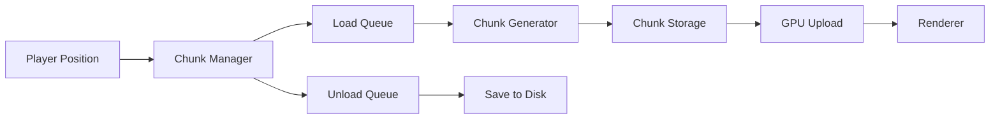

# Infinite Voxel World Optimization Techniques

**Research Date**: 2025-12-28
**Last Updated**: 2025-12-28
**Sources**: NVIDIA Research, Academic Papers (ACM SIGGRAPH), GitHub Implementations, Technical Blogs

## Table of Contents
- [Overview](#overview)
- [Sparse Voxel Octrees (SVO)](#sparse-voxel-octrees-svo)
- [Directed Acyclic Graphs (DAG)](#directed-acyclic-graphs-dag)
- [Level of Detail (LOD) Systems](#level-of-detail-lod-systems)
- [Chunk Streaming and Management](#chunk-streaming-and-management)
- [GPU Ray Marching Optimizations](#gpu-ray-marching-optimizations)
- [Memory Management Techniques](#memory-management-techniques)
- [Implementation Strategies](#implementation-strategies)
- [Performance Considerations](#performance-considerations)
- [Further Reading](#further-reading)

## Overview

Creating infinite voxel worlds like Minecraft requires sophisticated optimization techniques to handle vast amounts of data while maintaining real-time performance. This document synthesizes research on proven techniques for GPU-based voxel rendering systems, focusing on approaches compatible with Vulkan compute shaders.

### Key Challenges

- **Memory Constraints**: GPU memory is limited compared to the potentially infinite world size
- **Rendering Performance**: Millions of voxels require efficient traversal and culling
- **Dynamic Content**: World must support real-time modifications (block breaking/placing)
- **Streaming**: Loading and unloading chunks as the player moves
- **LOD Management**: Distant terrain must render with lower detail to maintain performance

## Sparse Voxel Octrees (SVO)

### Concept

Sparse Voxel Octrees are the foundational data structure for efficient voxel storage and rendering. Instead of storing every voxel in a uniform grid, SVOs use a hierarchical tree where each node represents an 8-voxel cube (octant).

### How It Works

1. **Hierarchical Subdivision**: Space is recursively divided into octants
2. **Empty Space Skipping**: Nodes representing empty space are omitted
3. **Leaf Nodes**: Contain actual voxel data at maximum resolution
4. **Internal Nodes**: Store pointers to 8 child octants (or null if empty)

### Efficient Sparse Voxel Octrees (ESVO)

**Paper**: "Efficient Sparse Voxel Octrees" by Samuli Laine & Tero Karras (NVIDIA Research, 2010)
**DOI**: 10.1145/1730804.1730814

#### Key Innovations

- **Contour Information**: Augments voxel data with geometric detail beyond octree resolution
- **Compact Storage**: Uses bit manipulation to minimize memory footprint
- **GPU-Optimized Traversal**: Ray casting algorithm designed for parallel GPU execution
- **Performance**: Competitive with triangle rendering for complex scenes

#### Data Structure

```
Node Structure (32 bits):
- 8 bits: Child validity mask (which children exist)
- 24 bits: Child pointer (offset to first child)

Leaf Data:
- Color/material information
- Normal vectors (optional)
- Contour data for sub-voxel detail
```

#### GPU Implementation

```glsl
// Pseudo-code for SVO ray traversal
struct SVONode {
    uint childMask;      // 8 bits indicating which children exist
    uint childPointer;   // Offset to first child in buffer
};

bool traverseSVO(Ray ray, out HitInfo hit) {
    vec3 pos = ray.origin;
    vec3 dir = ray.direction;

    uint nodeIdx = 0;  // Start at root
    uint level = 0;

    while (level < MAX_DEPTH) {
        SVONode node = nodes[nodeIdx];

        // Determine which octant ray enters
        uint octant = computeOctant(pos, level);

        // Check if child exists
        if ((node.childMask & (1 << octant)) == 0) {
            // Empty space - skip to next node
            pos = advanceToNextNode(pos, dir, level);
            continue;
        }

        // Descend to child
        nodeIdx = node.childPointer + countBits(node.childMask & ((1 << octant) - 1));
        level++;
    }

    return false;
}
```

### Building SVOs on GPU

```cpp
// High-level build process
1. Voxelize scene using rasterization pipeline
   - Render geometry from 3 orthogonal views
   - Mark occupied voxels in 3D texture

2. Build octree bottom-up
   - Process voxel grid in parallel
   - Merge 8 voxels into parent nodes
   - Propagate up to root level

3. Compact storage
   - Remove empty nodes
   - Pack child pointers efficiently
   - Upload to GPU buffer
```

**Reference Implementation**: [AdamYuan/SparseVoxelOctree](https://github.com/AdamYuan/SparseVoxelOctree)

## Directed Acyclic Graphs (DAG)

### Concept

DAGs extend SVOs by allowing nodes to share identical subtrees, dramatically reducing memory usage through structural deduplication.

### Key Papers

1. **"High Resolution Sparse Voxel DAGs"** - Kämpe, Sintorn, Assarsson (2013)
   - DOI: 10.1145/2461912.2462024
   - **Key Result**: 10-100x compression vs SVO for detailed scenes

2. **"SSVDAGs: Symmetry-Aware Sparse Voxel DAGs"** - Villanueva et al. (2016)
   - DOI: 10.1145/2856400.2856420
   - **Enhancement**: Exploits symmetry for further compression

### How DAGs Work

```
Traditional SVO:
    Root
   /    \
  A      B    <- Even if A and B are identical, both stored
 / \    / \
C   D  E   F

DAG:
    Root
   /    \
  A      A    <- B points to same node as A (shared)
 / \
C   D         <- Only one copy stored
```

### Memory Savings

For a voxel model with repeating patterns (common in procedural worlds):
- **SVO**: O(n) nodes where n = unique voxel combinations
- **DAG**: O(u) nodes where u = unique subtrees (typically u << n)
- **Real-world**: 10-100x reduction for architectural/natural scenes

### Implementation Approach

```cpp
// DAG Construction Algorithm
1. Build complete SVO first
2. Hash all nodes at deepest level
3. Merge identical nodes
4. Propagate merging up tree levels
5. Update parent pointers to merged nodes

// Node hashing
struct NodeHash {
    uint64_t hash;

    // Hash based on:
    // - Child existence mask
    // - Child node hashes (recursive)
    // - Leaf data (if leaf)
};

// Deduplication
unordered_map<NodeHash, uint> uniqueNodes;
for (each node) {
    NodeHash h = computeHash(node);
    if (uniqueNodes.contains(h)) {
        // Replace node with existing equivalent
        replaceWithNode(node, uniqueNodes[h]);
    } else {
        uniqueNodes[h] = node.id;
    }
}
```

### GPU Traversal

DAG traversal is identical to SVO traversal - the compression is transparent to the ray marcher. This makes DAG a drop-in memory optimization.

### Variants

- **PSVDAG** (Pointerless Sparse Voxel DAG): Eliminates pointers using implicit indexing
- **SSVDAG** (Symmetry-aware): Detects rotational/reflective symmetry
- **GSDAG** (Geometry + Attributes Separate): Separates topology from voxel attributes

**Documentation**: [Voxel Compression - DAG](https://eisenwave.github.io/voxel-compression-docs/dag/dag.html)

## Level of Detail (LOD) Systems

### Purpose

LOD reduces rendering complexity by using lower resolution representations for distant chunks, crucial for infinite worlds.

### Approaches

#### 1. Octree-Based LOD

Each chunk has multiple LOD levels stored in octree hierarchy:

```
LOD 0: 32³ voxels (full detail)
LOD 1: 16³ voxels (merge 2×2×2)
LOD 2: 8³ voxels  (merge 4×4×4)
LOD 3: 4³ voxels  (merge 8×8×8)
LOD 4: 2³ voxels  (merge 16×16×16)
```

**Storage**: Octree naturally contains all LOD levels

#### 2. POP Buffer LOD (Progressive Ordered Primitives)

**Paper**: "The POP Buffer: Rapid Progressive Clustering by Geometry Quantization" - Limper et al. (2013)

**Key Concept**: Vertex clustering via power-of-2 rounding

```glsl
// Compute vertex LOD level
int vertexLOD(vec3 vertex) {
    int x_lod = countTrailingZeros(int(vertex.x));
    int y_lod = countTrailingZeros(int(vertex.y));
    int z_lod = countTrailingZeros(int(vertex.z));
    return min(x_lod, min(y_lod, z_lod));
}

// Render at LOD level L
vec3 roundedVertex = floor(vertex / (1 << L)) * (1 << L);
```

**Advantages**:
- Implicit encoding (no extra storage)
- Continuous LOD transitions (geomorphing)
- Fast computation in shader

**Resource**: [0fps - LOD Method for Blocky Voxels](https://0fps.net/2018/03/03/a-level-of-detail-method-for-blocky-voxels/)

#### 3. Transvoxel Algorithm

**Paper**: "Voxel-Based Terrain for Real-Time Virtual Simulations" - Eric Lengyel (2010)

**Purpose**: Seamlessly stitches together meshes at different LOD levels

**Problem Solved**:
```
High-res chunk  |  Low-res chunk
----------------|----------------
████████████████|████████
████████████████|████████
████████████████|████████
████████████████|████████
                ^ Cracks form here
```

**Solution**: Transition cells that bridge resolution differences

- **73 equivalence classes** handle all 512 possible transition cases
- **Local operation**: Only requires adjacent voxel data
- **Dynamic**: Works with real-time terrain modification

**Resource**: [Transvoxel.org](https://transvoxel.org/)

#### 4. Distance-Based LOD Selection

```cpp
// Common LOD selection formula
float LOD_BIAS = 2.0;  // Tune for quality vs performance

float computeLOD(vec3 chunkPos, vec3 cameraPos) {
    float distance = length(chunkPos - cameraPos);
    return log2(distance / LOD_BIAS);
}

// Quantize to discrete levels
int lod = clamp(int(computeLOD(chunkPos, cameraPos)), 0, MAX_LOD);
```

#### 5. Quadtree/Octree LOD (Clipmap-style)

Organize chunks in nested grids around player:

```
Level 0 (highest detail): 3×3 chunks around player
Level 1: 5×5 chunks (excluding center already in L0)
Level 2: 9×9 chunks (excluding inner levels)
Level 3: 17×17 chunks
...
```

**Resource**: [Using Quadtrees for LOD in Voxel Generation](https://medium.com/@danieljackson97123/using-quadtrees-for-level-of-detail-in-voxel-generation-517f98f3bf50)

### Geomorphing for Smooth Transitions

Avoid popping artifacts by interpolating between LOD levels:

```glsl
float lodLevel = computeLOD(chunkPos, cameraPos);
int lod0 = int(floor(lodLevel));
int lod1 = int(ceil(lodLevel));
float t = fract(lodLevel);

// Interpolate vertex positions
vec3 pos0 = getVertexAtLOD(lod0);
vec3 pos1 = getVertexAtLOD(lod1);
vec3 finalPos = mix(pos0, pos1, t);
```

## Chunk Streaming and Management

### Minecraft-Style Approach

#### Chunk Loading Strategy

1. **Circular Load Pattern**: Load chunks in expanding circles around player
2. **Render Distance**: Typically 8-32 chunks (configurable)
3. **Priority Queue**: Closer chunks load first
4. **Async Generation**: Generate/load chunks on background threads

#### Data Flow



#### Implementation Pattern

```cpp
class ChunkManager {
    // Active chunks in memory
    HashMap<ChunkPos, Chunk*> loadedChunks;

    // Queue of chunks to process
    PriorityQueue<ChunkPos> loadQueue;

    void update(vec3 playerPos) {
        ChunkPos playerChunk = worldToChunk(playerPos);

        // Determine chunks that should be loaded
        for (int dx = -RENDER_DIST; dx <= RENDER_DIST; dx++) {
            for (int dz = -RENDER_DIST; dz <= RENDER_DIST; dz++) {
                ChunkPos pos = playerChunk + ivec2(dx, dz);
                float dist = length(vec2(dx, dz));

                if (dist <= RENDER_DIST && !loadedChunks.contains(pos)) {
                    loadQueue.push(pos, -dist);  // Negative for closer = higher priority
                }
            }
        }

        // Process load queue (limit per frame)
        for (int i = 0; i < MAX_CHUNKS_PER_FRAME && !loadQueue.empty(); i++) {
            loadChunk(loadQueue.pop());
        }

        // Unload distant chunks
        for (auto& [pos, chunk] : loadedChunks) {
            if (distance(pos, playerChunk) > RENDER_DIST + UNLOAD_MARGIN) {
                unloadChunk(pos);
            }
        }
    }

    void loadChunk(ChunkPos pos) {
        // Try to load from disk first
        if (Chunk* chunk = loadFromDisk(pos)) {
            loadedChunks[pos] = chunk;
        } else {
            // Generate new chunk
            Chunk* chunk = generateChunk(pos);
            loadedChunks[pos] = chunk;
        }

        // Upload to GPU
        uploadChunkToGPU(loadedChunks[pos]);
    }
};
```

### Procedural Generation

For infinite worlds, chunks are generated procedurally:

```cpp
Chunk* generateChunk(ChunkPos pos) {
    Chunk* chunk = new Chunk();

    // Deterministic generation based on world seed + position
    uint64_t seed = worldSeed ^ hash(pos);

    for (int x = 0; x < CHUNK_SIZE; x++) {
        for (int z = 0; z < CHUNK_SIZE; z++) {
            // Global coordinates
            int gx = pos.x * CHUNK_SIZE + x;
            int gz = pos.z * CHUNK_SIZE + z;

            // Multi-octave noise for terrain height
            float height = noise(gx, gz, seed) * 64.0;

            for (int y = 0; y < CHUNK_SIZE; y++) {
                int gy = pos.y * CHUNK_SIZE + y;

                if (gy < height) {
                    chunk->setBlock(x, y, z, selectBlockType(gy, height));
                }
            }
        }
    }

    return chunk;
}
```

### Chunk Modifications

```cpp
// When player breaks/places block
void modifyBlock(ivec3 worldPos, BlockType newType) {
    ChunkPos chunkPos = worldToChunk(worldPos);
    ivec3 localPos = worldToLocal(worldPos);

    Chunk* chunk = loadedChunks[chunkPos];
    chunk->setBlock(localPos, newType);

    // Mark chunk dirty for re-upload
    chunk->dirty = true;

    // Save modification for persistence
    saveChunkModification(chunkPos, localPos, newType);
}

// Later in update loop
void updateDirtyChunks() {
    for (auto& [pos, chunk] : loadedChunks) {
        if (chunk->dirty) {
            uploadChunkToGPU(chunk);
            chunk->dirty = false;
        }
    }
}
```

## GPU Ray Marching Optimizations

### DDA (Digital Differential Analyzer)

Current traversal algorithm - optimizations:

#### 1. Early Ray Termination

```glsl
const float MAX_DISTANCE = 1000.0;
float traveledDistance = 0.0;

while (traveledDistance < MAX_DISTANCE) {
    // ... traversal logic ...
    traveledDistance = length(rayPos - rayOrigin);
}
```

#### 2. Empty Space Skipping

```glsl
// Jump over empty chunks entirely
if (isChunkEmpty(currentChunk)) {
    // Calculate distance to next chunk boundary
    vec3 nextBoundary = getNextChunkBoundary(rayPos, rayDir);
    rayPos = nextBoundary + rayDir * EPSILON;
    continue;
}
```

#### 3. Hierarchical Traversal

Combine DDA with octree structure:

```glsl
// Start at coarse level
int level = MAX_OCTREE_LEVEL;

while (level >= 0) {
    if (isNodeEmpty(currentNode, level)) {
        // Skip entire node at this level
        advanceToNextNode(level);
        level = min(level + 1, MAX_OCTREE_LEVEL);
    } else {
        // Descend to finer level
        level--;
    }
}
```

#### 4. Frustum Culling

Don't raymarch pixels outside view frustum:

```glsl
// In compute shader
if (!isInFrustum(rayDir)) {
    imageStore(outputImage, pixelCoord, vec4(0.0)); // Sky color
    return;
}
```

#### 5. Beam Optimization

**Paper**: Various sources on voxel cone tracing

Group nearby rays into "beams" for coherent traversal:

```glsl
// Process 2×2 pixel groups together
layout(local_size_x = 2, local_size_y = 2) in;

shared vec3 sharedRayOrigin;
shared ivec3 sharedVoxelPos;

void main() {
    // Compute average ray direction for group
    vec3 avgDir = (ray0.dir + ray1.dir + ray2.dir + ray3.dir) * 0.25;

    // Traverse with shared direction, then refine per-pixel
    // ... beam traversal ...
}
```

### GPU Workgroup Optimization

```glsl
// Optimize for GPU cache coherency
layout(local_size_x = 8, local_size_y = 8) in;

// Use shared memory for frequently accessed data
shared uint sharedChunkData[CHUNK_SIZE * CHUNK_SIZE * CHUNK_SIZE / 64];

void main() {
    // Load chunk data into shared memory once per workgroup
    if (gl_LocalInvocationIndex == 0) {
        loadChunkToSharedMemory();
    }
    barrier();

    // All threads in workgroup can now access shared data efficiently
    // ... ray marching using sharedChunkData ...
}
```

## Memory Management Techniques

### 1. Sparse 3D Textures (Vulkan)

Vulkan supports sparse textures for voxel data:

```cpp
VkImageCreateInfo imageInfo = {};
imageInfo.flags = VK_IMAGE_CREATE_SPARSE_BINDING_BIT |
                  VK_IMAGE_CREATE_SPARSE_RESIDENCY_BIT;
imageInfo.imageType = VK_IMAGE_TYPE_3D;
imageInfo.extent = {WORLD_SIZE_X, WORLD_SIZE_Y, WORLD_SIZE_Z};
imageInfo.format = VK_FORMAT_R8_UINT;

// Only allocate memory for committed regions
VkSparseImageMemoryBind binds[NUM_LOADED_CHUNKS];
// ... bind only loaded chunks ...
vkQueueBindSparse(queue, &bindInfo, fence);
```

**Benefits**:
- OS manages paging automatically
- Only active chunks consume memory
- Transparent to shader code

### 2. Virtual Texturing

Similar to sparse textures, but with manual management:

```cpp
// Large virtual address space
3D Texture: 8192³ voxels (theoretical)

// Physical memory pool
Physical Pool: 512³ actual storage

// Indirection table
IndirectionTable[chunkX][chunkY][chunkZ] -> PhysicalPage

// In shader
ivec3 chunkId = worldPos / CHUNK_SIZE;
ivec3 localPos = worldPos % CHUNK_SIZE;
uint physicalPage = indirectionTable[chunkId];
BlockType block = physicalPages[physicalPage][localPos];
```

### 3. Streaming GPU Buffers

```cpp
class ChunkGPUManager {
    VkBuffer chunkBuffer;
    VkDeviceMemory chunkMemory;

    // Ring buffer for chunk data
    static const int MAX_GPU_CHUNKS = 1024;
    uint32_t nextSlot = 0;

    uint32_t uploadChunk(Chunk* chunk) {
        uint32_t slot = nextSlot;
        nextSlot = (nextSlot + 1) % MAX_GPU_CHUNKS;

        // Upload chunk data to slot
        void* data;
        vkMapMemory(device, chunkMemory, slot * CHUNK_SIZE_BYTES,
                    CHUNK_SIZE_BYTES, 0, &data);
        memcpy(data, chunk->data, CHUNK_SIZE_BYTES);
        vkUnmapMemory(device, chunkMemory);

        return slot;
    }
};
```

### 4. Compression

**On-GPU Decompression**:

```glsl
// Run-length encoded voxel data
struct RLESegment {
    uint blockType : 8;
    uint runLength : 24;
};

// Decompress in shader
BlockType getBlock(ivec3 pos) {
    uint linearIndex = pos.x + pos.y * SIZE + pos.z * SIZE * SIZE;

    // Binary search through RLE segments
    uint segmentIdx = binarySearch(rleSegments, linearIndex);
    return BlockType(rleSegments[segmentIdx].blockType);
}
```

## Implementation Strategies

### Hybrid Approach (Recommended)

Combine multiple techniques for optimal results:

```
1. Chunk System (Minecraft-style)
   ├── 32³ voxel chunks
   ├── Procedural generation
   └── Dynamic loading/unloading

2. Per-Chunk Storage (DAG or Compressed)
   ├── DAG for static, detailed chunks
   ├── Simple array for dynamic/sparse chunks
   └── Compression for disk storage

3. LOD System
   ├── Octree-based LOD within chunks
   ├── Distance-based chunk LOD
   └── Transvoxel transitions

4. GPU Rendering
   ├── Compute shader ray marching
   ├── Hierarchical traversal
   └── Frustum culling

5. Memory Management
   ├── Sparse 3D textures (if supported)
   ├── Virtual texturing fallback
   └── Ring buffer for GPU uploads
```

### Migration Path from Current System

Your current architecture → Infinite world:

```
Phase 1: Chunk System
- Divide world into 32³ chunks
- Implement chunk loading/unloading
- Add chunk position to world coordinates conversion

Phase 2: Procedural Generation
- Replace hardcoded world with noise-based generation
- Implement chunk save/load for modifications

Phase 3: GPU Upload Optimization
- Implement ring buffer for chunk streaming
- Add sparse texture support (if available)
- Optimize dirty chunk re-uploads

Phase 4: LOD Implementation
- Add distance-based LOD selection
- Generate multiple LOD levels per chunk
- Implement transition algorithm (Transvoxel or POP buffer)

Phase 5: Advanced Optimization
- Consider DAG compression for static chunks
- Add hierarchical traversal to shader
- Implement beam optimization for coherent rays
```

## Performance Considerations

### Benchmarks (Typical)

| Technique | Memory Reduction | Performance Impact | Complexity |
|-----------|------------------|-------------------|------------|
| **Basic SVO** | 10-50x vs dense | Minimal | Medium |
| **DAG** | 10-100x vs SVO | Minimal | High |
| **LOD** | 4-16x (distance dependent) | 2-4x faster | Medium |
| **Chunk Streaming** | Constant memory | Minimal (if async) | Medium |
| **Sparse Textures** | OS-managed | Hardware-dependent | Low (if supported) |

### Common Pitfalls

1. **CPU-GPU Synchronization**: Async chunk uploads avoid frame hitching
2. **LOD Popping**: Use geomorphing or careful distance thresholds
3. **Cache Thrashing**: Structure traversal for spatial coherence
4. **Memory Fragmentation**: Use ring buffers and fixed-size allocations

### Optimization Priority

For your Vulkan compute shader engine:

1. ✅ **Chunk System** - Essential for infinite worlds
2. ✅ **Async Loading** - Prevents stuttering
3. ✅ **Distance-based LOD** - Major performance win
4. ⚠️ **Sparse Textures** - Use if available, virtual texturing otherwise
5. ⚠️ **DAG Compression** - Only if memory becomes bottleneck
6. ⚠️ **Beam Optimization** - Advanced, significant complexity

## Further Reading

### Papers

1. **Laine, S., Karras, T.** "Efficient Sparse Voxel Octrees" (2010)
   - [NVIDIA Research](https://research.nvidia.com/publication/2010-02_efficient-sparse-voxel-octrees)
   - DOI: 10.1145/1730804.1730814

2. **Kämpe, V., Sintorn, E., Assarsson, U.** "High Resolution Sparse Voxel DAGs" (2013)
   - [PDF](https://www.cse.chalmers.se/~uffe/HighResolutionSparseVoxelDAGs.pdf)
   - DOI: 10.1145/2461912.2462024

3. **Villanueva, A.J., et al.** "SSVDAGs: Symmetry-Aware Sparse Voxel DAGs" (2016)
   - DOI: 10.1145/2856400.2856420

4. **Lengyel, E.** "Voxel-Based Terrain for Real-Time Virtual Simulations" (2010)
   - [Transvoxel Algorithm](https://transvoxel.org/)
   - PhD Dissertation, UC Davis

5. **Limper, M., et al.** "The POP Buffer: Rapid Progressive Clustering by Geometry Quantization" (2013)
   - [Paper](https://x3dom.org/pop/)

### Implementations

1. **AdamYuan/SparseVoxelOctree** (GitHub)
   - Vulkan-based SVO with GPU builder
   - Ray marcher + path tracer
   - [Repository](https://github.com/AdamYuan/SparseVoxelOctree)

2. **otaku690/SparseVoxelOctree** (GitHub)
   - Educational SVO implementation
   - Level-by-level building approach
   - [Repository](https://github.com/otaku690/SparseVoxelOctree)

### Tutorials & Resources

1. **0fps Blog** - Blocky Voxel LOD
   - [Article](https://0fps.net/2018/03/03/a-level-of-detail-method-for-blocky-voxels/)
   - POP buffer technique explained

2. **Voxel Engine Tutorial Wiki**
   - [LOD Tutorial](https://voxelenginetutorial.wiki/lod.html)
   - Practical implementation guide

3. **Voxel Compression Documentation**
   - [Eisenwave's Guide](https://eisenwave.github.io/voxel-compression-docs/dag/dag.html)
   - Comprehensive compression techniques

### Community Resources

1. **r/VoxelGameDev** (Reddit)
   - Active community discussing voxel techniques
   - Regular implementation showcases

2. **Transvoxel.org**
   - Official Transvoxel algorithm documentation
   - Lookup tables and implementation guide

## Notes

### Vulkan-Specific Considerations

- Sparse image support varies by GPU (check `VkPhysicalDeviceFeatures::sparseBinding`)
- Compute shader ray marching is well-suited for voxel traversal
- Use storage buffers for chunk data, not uniform buffers (size limits)
- Consider `VK_EXT_descriptor_indexing` for dynamic chunk access

### Version Compatibility

- SVO techniques: Universal (any GPU with compute)
- DAG: Requires sufficient GPU memory for hash tables during build
- Sparse textures: Requires hardware support (check device features)
- Algorithms are resolution-independent and scale with hardware

### Trade-offs

**Memory vs Speed**:
- Uncompressed: Fastest access, high memory
- SVO: Balanced
- DAG: Best compression, slightly slower build time

**Quality vs Performance**:
- Full resolution everywhere: Best quality, impossible for large worlds
- Aggressive LOD: Best performance, visible quality loss
- Hybrid with geomorphing: Best of both worlds

### Production Readiness

Techniques marked ✅ are production-proven (used in shipping games):
- ✅ Chunk streaming (Minecraft, countless voxel games)
- ✅ SVO (Various research projects, some commercial)
- ✅ LOD with Transvoxel (Multiple voxel engines)
- ⚠️ DAG (Research-heavy, fewer production uses)
- ⚠️ Sparse textures (Hardware-dependent, limited adoption)
