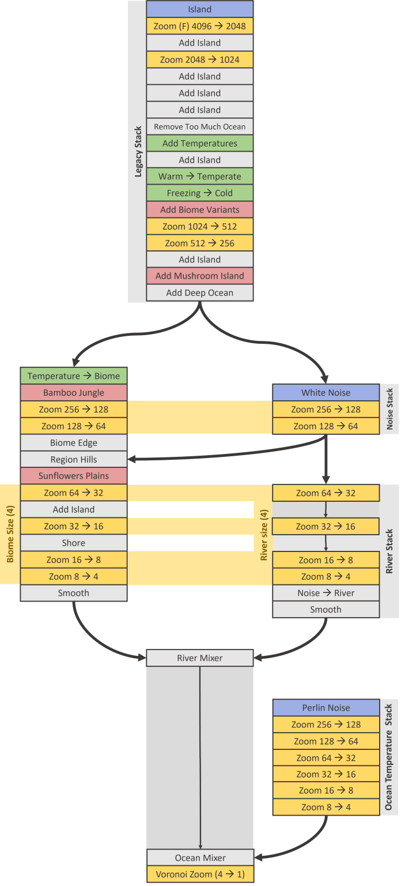
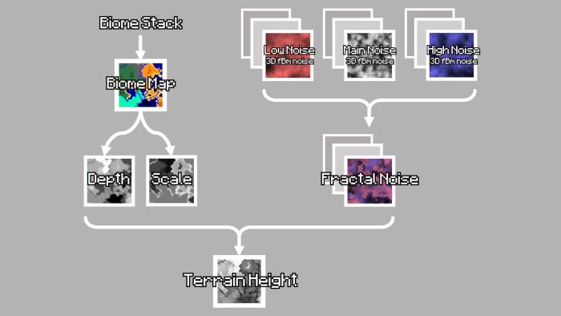
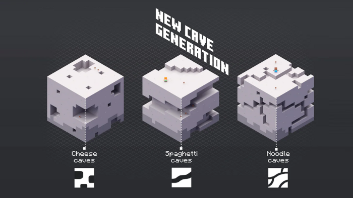
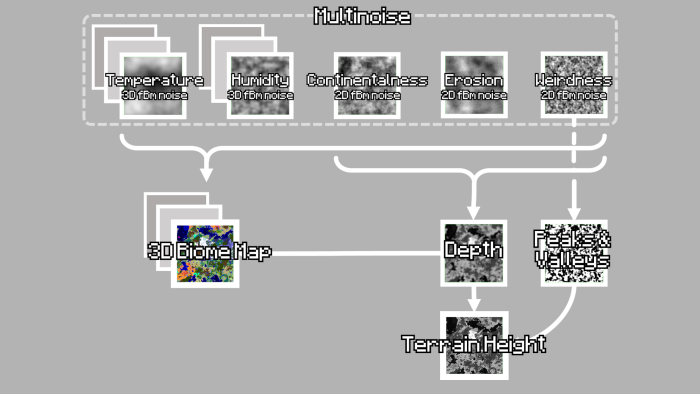
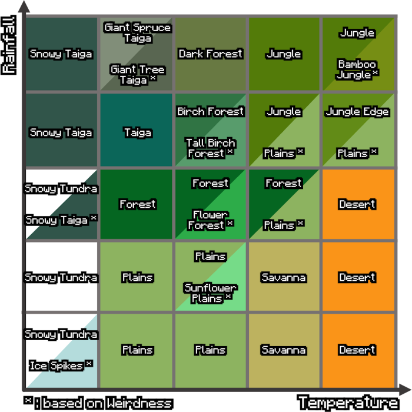

Biome Map
Generating the biome map is the most critical phase, as it serves as the blueprint the rest of the world is built from.

The map is built using a sequence of fairly simple operations, referred to as “layers”, which are stacked on top of each other. Each layer takes the biome map from the previous one, adds some details, and passes it to the next one.

Minecraft worlds are crafted using not one but four different stacks.
The main one is responsible for the land, while two smaller ones are used to draw the rivers and to give temperatures to the ocean. An additional stack is used to add even more nuances to hills and rivers.

It all starts with a noise map–an image generated randomly—which features only two colours, representing land and ocean in a 1 to 10 proportion. The process is not dissimilar to rolling a D10 for each pixel: if you get a 1, it becomes land, otherwise it becomes an ocean.

Minecraft obviously doesn’t have a D10 at its disposal, but it can nonetheless “roll” random numbers using what is known as a quadratic congruential generator.

Internally, the source code calls this the Island Layer, as each individual pixel of this noise map will be the template from which continents will emerge. Each pixel, in fact, corresponds to 4096 in-game blocks.

The deeper we go in the biome stack, the more refined the details added are. This is possible due to a series of scaling layers, which increase by a factor of two the resolution at which the following layers will operate.

For example, if a pixel from the Island layer corresponds to 4096 blocks, each pixel added after the zoom will have an in-game size of 2048 blocks.

Minecraft is using the Zoom layers for another important task: adding variation. Instead of scaling the maps perfectly, they sometimes introduce some small changes. They are coded to work more like an old photocopier: adding the occasional mistake and smudging the edges of what would otherwise be some perfectly square islands.

The next layer encountered in the biome stack is designed to expand the existing islands, creating a more connected world.

Every piece of land has a chance of expanding into the corners of nearby shallow waters, but can also be eroded in the process.

If we run this layer over and over again, we can see that it doesn’t always produce the same effect. Even layers introduce randomness!

So perhaps a better way to understand how most of them work, is to see them as stochastic cellular automata. Which is just a fancy way of saying that they’re simple rules that change a pixel based on the colour of the surrounding ones. The “stochastic” part comes into play because some of those rules might be driven by randomness.

Most of the land shape is created by alternating AddIsland and Zoom layers. This allows the world to have prominent features at various different resolutions.

Ocean Regions
The ocean, on the other hand, is mostly shaped by these two layers.

The first one was added in the “Adventure Update” to specifically make the word less “continental” and more “connected”. Internally, Minecraft literally calls it Remove Too Much Ocean, leaving very little to the imagination.

All ocean regions surrounded by more ocean have a 50% chance of becoming land.

This not only creates more fragmented coasts, but also brings the amount of land versus ocean from barely 27% to over 50%.

The next layer from the main stack marks all ocean regions that are surrounded by more ocean as “deep”. This will later give rise to shallow ocean and deep ocean biomes.

Temperatures & Biomes
Up to this point, we have only mentioned two things: land and ocean. As a prelude to biomes, a series of climate layers are responsible for determining the temperature of each region: either Warm, Temperate, Cold or Freezing. Later in the stack, this information will determine which biomes these regions can turn into.

First: each piece of land is randomly assigned a temperature: Warm, Cold or Freezing, in proportions of 4, 1 and 1 respectively.

With such a random distribution, you could very well have a desert next to a snowy tundra. To avoid that, the following two layers blend each region’s temperature, ensuring a smoother transition between them.

Any warm land adjacent to a cool or freezing region will turn into a temperate one instead.
And any freezing land adjacent to a warm or temperate region will turn cold.

These temperatures are ultimately the main factor in determining which biome a piece of land will end up being. For example, Warm regions have a 50% chance of turning into a Desert, 33% into a Savanna, and the remaining 17% into Plains.

In a similar process, Temperate, Cold and Freezing regions will have certain probabilities of turning into their respective Temperate, Cold and Freezing biomes (such as forests, taigas and ice plains).

Biome Variants
Up to this point, the landscape already looks familiar but lacks variation within the individual biomes. To fix this, this layer has a small chance of converting a biome into its “hilly” variant. For example, it could turn a Desert into a Desert Hill, a Forest into a Wooded Hill, or a Savanna into a Plateau.

This layer also works on ocean regions and can turn deep oceans into plains or forests. This is what disseminates the ocean with a lot of tiny islands.

The decision on which areas to change comes from an additional noise map which is Generated by a separate stack. When the colour of each pixel is chosen at random and independently from the others–like in this case–we talk about “white noise”. Which is pretty much the same distribution you get when an old TV is not receiving any signal.

Usually, every layer operates on the map locally, ignoring the big picture. And with so many steps it’s hard to guarantee a harmonious blend between biomes.

To avoid any problem, two more layers are tasked with ensuring a gentle transition between different climates and extreme regions exists at all times.

The second one, Shore, also adds beaches where land meets shallow oceans.

Rare Biomes
Rare biomes deserve a special mention, as their generation works in a slightly different way. On top of assigning temperatures, the climate layer has a 1 in 13 chance of tagging a region as “special”.

When the time comes to assign biomes based on temperatures, special regions get a special treatment. Warm, Temperate and Cold climate regions all have their own special biome variants they turn into: badland plateaus, jungles and giant tree taigas.

A different story takes place for the more niche biomes such as Bamboo Jungles and Sunflower Plains, as the idea is not to have them on their own, but as small patches within much larger regions.

And so, two additional layers are responsible for randomly turning one jungle out of 10 into a Bamboo Jungle, and one Plains out of 57 into a Sunflower Plains.

The somewhat legendary Mushroom Islands are created in a similar fashion. With each ocean block surrounded by water having a 1 in 100 chance of turning into a mushroom field. The layer responsible for this is pretty high in the stack, which is why mushroom islands tend to be quite large and uniform.

This is also one of the rarest biomes in Minecraft, and the only one in which hostile mobs don’t naturally spawn.

River Stack
The main stack focuses mostly on the land, and does nothing to create rivers. They’re generated in a separate stack, which operates on the same noise map used for the hills.

After being scaled several times, the noise map looks quite patchy. The River Layer works as a kind-of edge detection algorithm, creating candidate river beds along the seams of those patches.

They are then smoothed to fix any gaps or rough edges with a low-pass filter, and finally feed into the main stack through the River Mixer Layer.

That simply carves a river into the land, with the exception of snowy tundra biomes–which get frozen rivers instead–and mushroom fields, which apparently have no rivers at all.

Ocean Temperature Stack
The last bit involved in the biome generation is the Ocean Temperature stack. It adds variety to the oceans which–besides being shallow or deep–would otherwise have no other distinctive features.

The stack creates its own temperature map using a technique known as Perlin noise. That is a very common algorithm for procedural noise maps, which was originally developed in 1982–not for a game–but for the movie “Tron”.

If you create a white noise map by rolling a dice for each pixel–like the first layer was doing–the overall result will look unpleasantly rugged, because nearby pixels will likely have very different values. Perlin noise, instead, is known to create very pleasant, very smooth images.

And it does so by generating random values on a grid much larger than the final image we want to render. All the points in between are then gently interpolated between those random values, resulting in a much smoother finish. There is much more to Perlin noise than this, but that is as far as we will go.

Once ready, the map is scaled up to size and merged into the full stack through the OceanMixer Layer. This finally gives a biome to the ocean regions, which can now be warm, lukewarm, cold or frozen.

The very final step–this time for real–is to upscale the map two more times. This is not done using the traditional Zoom layers that we have seen before, but it relies on a different technique which breaks up even more the edges between the different biomes.

After this, we are left with the actual biome map, in which each pixel corresponds to an actual in-game block.

We are now ready to move to the next stage!

Terrain Height
The second phase of the world generation focuses on the terrain, and works in three steps.

In the third step, caves and ravines are literally carved out of stone. This is done with a slightly more sophisticated variant of “random walk”, called “Perlin worms”. But at its core, the idea is the same: gently moving a sphere in random directions, carving long tunnels along its path.

Out of the three steps that Minecraft takes to generate its terrain, the first one definitely needs a bit more explanation.

Minecraft builds a complex and interesting terrain through a technique known as “fractal Brownian motion noise”: yet another type of noise map.

Fractal noise is constructed by adding together several Perlin noise maps, sampled at different scales. Each new one—called an octave—has double the resolution of the previous one, but its contribution is also halved.

Fractal noise is famously good at generating plausible-looking terrains. And it works because it adds different amounts of details at different scales. Exactly what we can see on a real landscape.

Minecraft could have easily sampled a fractal map at every \left(x, z\right) coordinate to get the respective terrain height–like you see here. But this is not how the game actually works!

So how is Minecraft getting the terrain height? Well, it starts at the very top of the world, at y=255, and keeps moving downward, calculating the fractal noise value at each specific \left(x,y,z\right) location along that vertical column. The first y coordinate for which the fractal noise is equal to or above zero will become the final height of the terrain at that \left(x, z\right) coordinate.

An early devlog described the rationale behind this process saying that we should interpret
“the noise value as the “density”, where anything lower than 0 would be air, and anything higher than or equal to 0 would be ground.”

That very same post also mentioned how computationally expensive this process is. So, as a form of optimisation, this fractal noise map is sampled at a lower resolution, with the world split into “cells” of 4x8x4 blocks each.

To be more precise, Minecraft isn’t using one single fractal noise map: it’s using three of them! The reason is simple: those maps are awesome, but they are also fairly uniform. By using two, initialised with different parameters, and blended according to a third noise map, Minecraft is able to add even more interesting, natural-looking variation to the terrain.

But that’s not all! In earlier versions of Minecraft, the biomes and the terrain height map were independent of each other. But from Beta 1.8 onwards, that is no longer the case, and the biome map directly affects the terrain generation by modulating how tall each biome can be.

It does so via two parameters: “depth” and “scale”. Those values depend on the type of biome, and represent its average height and how much it can vary from that. Having the biome directly linked to the terrain height ultimately results in a more natural looking landscape, preventing bizarre things like …a mountain beach, for example.

Technically speaking, there are at least two more noise maps involved in the terrain generation. The “Depth noise” map adds a bit of extra variability to compensate for the fact that the interpolation between cells smooths out the finer details.
And the “Surface noise” which determines how many blocks of stone need to be replaced with the default block in each biome.

And there are probably at least ten more, involved in minor details such as the flower distribution. But we are not going to go that deep in this article!

World Features
After the biome map and the terrain height, we are pretty much left with a finished landscape, but devoid of any vegetation, animal, structure or even ore.

And yet, no Minecraft world would be truly complete without its dozens of different features: grass, flowers, trees, mushrooms, mineshafts, villages, ore veins, and amethyst geodes, fossils, ocean monuments, huts, jungle and desert temples, icebergs, igloos, shipwrecks, ocean ruins and woodland mansions.

CAVES AND CLIFFS

Because with the “Caves & Cliffs Update”, Minecraft 1.18 brings on a completely new terrain generator. While before the landscape was only 128 blocks tall, now it can stretch up to 320 blocks. With so much more vertical space to play with, it is not surprising that one of the biggest changes is mountains, which are now much taller and proportionate to the rest of the world.

And to avoid disasters when playing old worlds in Minecraft 1.18, there is some clever blending going on. This helps the new chunks to seamlessly integrate with the surrounding landscape and biomes.

But what really makes the difference is that Minecraft 1.18 uses a completely new algorithm to generate its biome maps. And this can be seen quite clearly when we compare them to older versions built using the layer stack we have seen before. The slide below shows how a Minecraft world dramatically change from 1.16 (left) to 1.18 (right):

And even more important is the fact that now biomes are–to a certain extent–3D! This allows underground caves to have their own biomes, as the much anticipated lush caves do.

And this plays an important role in the new cave system too. On top of carving its caves using Perlin worms, Minecraft 1.18 introduces three new types of caves: cheese caves, spaghetti caves and noodle caves. Yes, you heard that right.

They all generate the same way: applying a threshold to a 3D perlin noise map to decide which underground areas are going to be carved out of the solid stone. And just by seeding these noise maps with different parameters, they can produce large caves, long tunnels, or a fine network of interconnected passageways. Cheese, spaghetti and noodles.

And there is also a new feature that creates pillars inside caves.

The update also ties the cave generation with a new ore distribution, which is supposed to encourage digging and exploration.

So I know what you’re going to ask. How does Minecraft 1.18 actually work? Well… it’s complicated. And also, given how recent it is, it might be a bit premature to go into the details of a system that is still subject to fixes and changes.

But just to quench your thirst, the biome and terrain are now even more linked together.
If before the landscape was modulated by its biome, now they both depend on a 3D climate map.

Each quarter-chunk–an area of 4x4x4 blocks–gets five climate parameters from a noise map: temperature, humidity, continentalness, erosion and weirdness.

Besides the first obvious two, continentalness controls how far a region is from the coast, and erosion dictates how flat or mountainous the terrain should be. The last one, weirdness, determines biome variants.

Each biome is defined by its own ideal temperature, humidity, continentalness, erosion and weirdness. With each quarter-chunk assigned to the biome that most closely matches those five parameters.

A standard desert, for instance, will have high temperature, continentalness and erosion, while low humidity and weirdness. All regions matching those parameters will become deserts.

